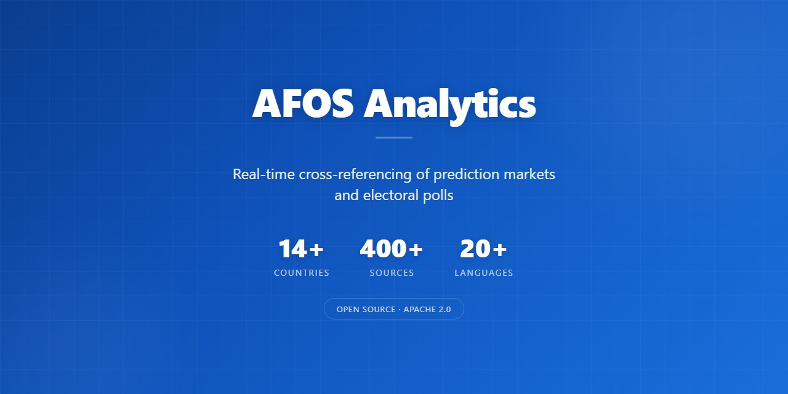
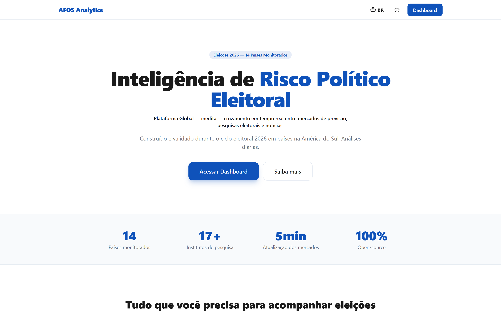

# AFOS Analytics



🇧🇷 [Leia em Português](README.pt-BR.md) | 🇺🇸 English

### Global platform, unprecedented, real-time cross-referencing of prediction markets, electoral polls and news.

Built and validated during the 2026 electoral cycle across South American countries + 15 countries. Daily analyses.

**Aggregating over 400 sources** (5 major global prediction markets + 100+ polling institutes + 300+ media outlets and social networks, 20+ languages) across **14+ countries.**

[](https://github.com/AFOS-Analytics/afos-analitica-2026/stargazers)

[](https://dataverse.harvard.edu/dataverse/afos-analytics)
[](mailto:contact@afos-analytics.com)
[](mailto:security@afos-analytics.com)

**[afos-analytics.com](https://afos-analytics.com)**

> *Democracy runs on information. Information runs on transparency. AFOS Analytics is programmable transparency worldwide.*

> Scalable pipeline with cron, Redis, and Neon. Add sources per country as elections approach.

---

## About

**AFOS Analytics** is the world's first political electoral risk intelligence platform that cross-references in real time:

- **Prediction markets** with real money (Polymarket), odds updated every 30 minutes
- **Electoral polls** from official sources (TSE) + 17 Brazilian institutes
- **Live news** from major media outlets
- **Strategic analyses** powered by artificial intelligence
- **AFOS Daily**, narrative daily synthesis cross-referencing the three sources, with auditable links per claim. Validated through a 7-day pilot (April 22-28/2026), now permanent, **123 editions published as of 22/Aug/2026**, in 3 languages (PT-BR, EN, ES) with full archive at `/daily/[date]`. Distribution by email to opted-in subscribers via Resend Pro. Hard ceiling of **900 words** in the body, measured excluding tables and URLs, which are not reading. ⭐ The closing **"In summary"** block is three PARAGRAPHS, each opening with a **bold thesis sentence** followed by the numbers that prove it, not a numbered list of one-line claims: whoever reads only the bold text gets the whole piece, whoever reads it all gets the figures. Format set on 22/Aug/2026 after the previous one was called thin twice in two days, and the fix turned out to be one of FORM, not of volume
- **AFOS Tradeoff**, weekly technical reading published every Monday, targeted at institutional research, buy-side and treasury. Cross-references the same three signals but reports them **separately** (no weighted-average composites), when prediction markets, polls and news diverge, the divergence *is* the signal. Structured in 9 sections (executive summary cards, anti-average rationale, weighted scenarios, indicator grid, liquidity & market structure, polls calendar, watch list, methodology, additional reading). Published in 3 languages (PT-BR, EN, ES) with full archive at `/tradeoff/[country]/[date]` (`/br`, `/us`). **15 Brazilian issues and 5 US issues published as of 31/Aug/2026.** RSS: `/feed/tradeoff.xml` and `/feed/tradeoff-us.xml`

  ⚠️ **The rich frontmatter is a contract, and the loader's `coerce*` functions fail silently in three different ways.** A required field under the wrong name makes the row be **dropped** (`indicatorGrid` filters on `contract`); an **enum with an invalid value falls back to the default**, which is worse, because the section keeps the right size and shows a wrong-but-plausible value that leaves no trace. `scenarios[].type` accepts **`base | bear | tail` only**: `contrarian` does not exist and silently becomes `base`. That shipped in six Brazilian issues (№8 to №13) between 13/Jul and 17/Aug/2026, rendering the against-the-pricing scenario in the base scenario's colour, and it was corrected on 23/Aug across 18 files. The rule that catches it is counting each block through the loader before the preview, and the reason it survived six issues is that the rule lived in the `/tradeoff-usa` skill and in neither `/tradeoff-brz` nor `/weekly-usa`; it is now in all three. 🔴 **The third way was found on 30/Aug/2026 while preparing Brazilian issue №15, and counting blocks does not catch it**: the liquidity callout was written as `anomaly` and the loader reads `anomalyText`, so the whole finding would have vanished from the page with no error and no log. A block count compares **array lengths**, and no array shrinks when a scalar text field goes missing. The suspicion came from opening the previous issue and comparing field by field, not from any gate. `scripts/check-tradeoff-blocos.ts` now closes all three by comparing the file against what the loader actually returned: block count, enum value, and **every text field, path by path**. It runs over every published edition of both countries and was proven by breaking each of the three on purpose and watching it go red.
- **AFOS Weekly**, weekly editorial published every Thursday on the 2026 US midterms, written for **ordinary voters** rather than for institutional research. **Issues №1 to №3 published, the most recent on 20/Aug/2026**, in all three languages. The two-edition pilot was reviewed after Issue №2 and confirmed to continue. The boundary with the Tradeoff is deliberate and is written into the code: the Tradeoff answers "what the prediction market is paying", the Weekly answers "who disagrees with whom, and what that means for someone about to vote". 7 sections (TL;DR, what the prediction market did, what the polls did, what the press reported, the crossing of the week, how to read this number, sources), no financial disclaimer, a 1,100-word ceiling (the Daily stays at 900; same figure, two products, opposite decisions). 🔴 **English is the origin language**, the inverse of every other product: PT-BR and ES are derivatives, and a missing translation falls back to English, never to Portuguese. Archive at `/weekly/[country]`, editions at `/weekly/[country]/[date]`. Still `noindex` while the pilot runs
- **AFOS Chat**, conversational agent available as a **floating bubble on every page** (and full-screen at `/chat`) that answers in natural language by querying the platform's **live data via tool-calling**: Polymarket odds, TSE polls, the **validated cases & market×poll divergence**, news, and the latest AFOS Daily, **every answer cites its source**, with the same radical-honesty rules (a prediction market is an implied probability, not a forecast; divergence is the signal, the real result is the validator). Trilingual (PT-BR, EN, ES), streamed responses, powered by **OpenRouter (DeepSeek V4 Flash)**. Public with per-IP rate limiting

Coverage of **14+ countries** with monitored elections, in **3 languages** (PT-BR, EN, ES).

**Open Source. Free. Mobile and desktop.**

### Platform demo (~90 seconds)

[](https://github.com/AFOS-Analytics/afos-analitica-2026/raw/main/public/demo-en.mp4)

> **Click the image above to play** (~9 MB, audio in PT-BR with English subtitles burned-in). Covers: real-time cross-referencing, prediction markets, electoral polls, news aggregation, and the **AFOS Daily** narrative synthesis. Alternative tracks: [`public/demo.mp4`](https://github.com/AFOS-Analytics/afos-analitica-2026/raw/main/public/demo.mp4) (no subtitles) and [`public/demo-audio.m4a`](https://github.com/AFOS-Analytics/afos-analitica-2026/raw/main/public/demo-audio.m4a) (audio only).

---

## Community

- 💬 **Questions & ideas** → [GitHub Issues](https://github.com/AFOS-Analytics/afos-analitica-2026/issues) · [Discussions](https://github.com/AFOS-Analytics/afos-analitica-2026/discussions)
- 🏢 **GitHub Organization** → [github.com/AFOS-Analytics](https://github.com/AFOS-Analytics)
- 🐦 **Twitter / X** → [@AFOS_Analytics](https://x.com/AFOS_Analytics)
- 🦋 **Bluesky** → [@afos-analytics.com](https://bsky.app/profile/afos-analytics.com)
- 🚀 **Product Hunt** → [@afosanalytics](https://www.producthunt.com/@afosanalytics)
- 📧 **Press, partnerships, general** → [contact@afos-analytics.com](mailto:contact@afos-analytics.com)
- 💡 **User support & help** → [support@afos-analytics.com](mailto:support@afos-analytics.com)
- 🔒 **Security vulnerability disclosure** → [security@afos-analytics.com](mailto:security@afos-analytics.com) (see [SECURITY.md](SECURITY.md))
- 👤 **Founder direct** → [founder@afos-analytics.com](mailto:founder@afos-analytics.com)

Open source. **Code** is licensed under **Apache 2.0**; **data** (e.g. the public divergence dataset mirrored daily to [Hugging Face](https://huggingface.co/datasets/AFOS-Analytics1/brazil-2026-electoral-divergence)) is licensed under **CC BY 4.0**, both require attribution to AFOS Analytics. Contributions welcome, see [CONTRIBUTING.md](CONTRIBUTING.md). Trademark use of the "AFOS Analytics" name and logo is governed by [TRADEMARK.md](TRADEMARK.md). Hosted-platform contributions (onboarding a new country) are documented at [docs/platform/add-your-country.md](docs/platform/add-your-country.md) and the public governance model is explained at `/methodology/automated-governance`.

---

## Architecture

### Main Routes

| Route | Content |
|-------|---------|
| `/[locale]` | Landing page (color + language selector) |
| `/[locale]/dashboard` | **307 redirect to `/dashboard/br`** since 29/Jul/2026, when the panel gained a country in the address. Old links never break |
| `/[locale]/dashboard/br` | Brazil panel, interactive dashboard with live data, header logo links back to landing. After the Polymarket odds cards it carries the **navigable cross-reference graph** (the "brain"): live market×poll divergence plus clickable nodes to the Brazil HF dataset, the structural-context card, the platform products, the dashboard sections and Harvard Dataverse |
| `/[locale]/dashboard/us` | US panel, 2026 midterms (3 Nov). **Published on 01/Aug/2026**: indexable, in the sitemap, in `llms.txt`, pinged to IndexNow, and live in the country selector. Seven blocks: intro card, prediction market (8 Polymarket markets, every card clickable through to the real market), Republican Senate-seat distribution, generic-ballot polling for the **House**, cross-reference graph, World Bank structural context, press (automatic, fixed outlet list), declared limitations. ⚠️ **The market×poll edge in the graph is MUTE**: the market prices the probability of controlling a chamber and the poll measures a lead in vote points, so no Δpp is shown, by design. A band market only reaches the screen if its bands total between 95% and 105%; the popular-vote-margin market is collected daily but stays off screen, measured between ~145% and 152.00% (21/Aug/2026). **The generic-ballot reader has two gates**: a shape gate (row with no fieldwork date or an unreadable institute) and a **value gate** (a party outside 15-70%, or the two summing above 100). Both discard *and count*, never silently. The value gate was added on 01/Aug/2026 after a row was published as "D 914 x R 3.2", where 914 was the sample size and 3.2 the margin of error: the source uses `rowspan` on the margin column too, so follow-up rows slid one column over. The reader now resolves `rowspan` per column index |
| `/[locale]/daily` | AFOS Daily, daily narrative synthesis cross-referencing prediction markets, polls and news. Available in **3 languages** (PT-BR, EN, ES), loader detects `{date}.{locale}.md` with fallback to canonical PT-BR. Brazilian political terms (TSE, STF, BolsoMaster, etc.) kept in PT with inline links to the trilingual glossary. **Index route = editions archive** (month-grouped list of every published edition, latest highlighted, jump-to-date + in-page language & theme selectors); individual editions live at `/[locale]/daily/[date]` with prev / next + "All editions" navigation |
| `/[locale]/tradeoff` | AFOS Tradeoff, weekly technical reading (Mondays) targeted at institutional research / buy-side / treasury. Three signals reported separately, divergence *is* the signal, not noise to average away. 9 structured sections rendered via rich-frontmatter YAML (summary cards, anti-average rationale, weighted scenarios, indicator grid, liquidity & market structure, polls calendar, watch list, methodology, additional reading). Tri-locale parity with Daily (`{date}.{locale}.md`). **Index route = editions archive** (list by issue number & week, latest highlighted, in-page language & theme selectors); editions live at `/[locale]/tradeoff/[country]/[date]` with prev / next + "All editions" navigation. RSS: `/feed/tradeoff.xml`. ⚠️ **The country segment is mandatory and the country-less edition address is a 404** since 07/Aug/2026. It used to 307 to Brazil, which was right while Brazil was the only country and became wrong on 03/Aug, when both countries published on the same date and `/en/tradeoff/2026-08-03` answered 307 with the **Brazilian** edition. An ambiguous address resolved in silence is worse than one that does not exist. The short form `/[locale]/tradeoff` with no segment still redirects to Brazil: what died is the ambiguous form, never the short one |
| `/[locale]/weekly/[country]` | **Weekly editions archive**, built on 06/Aug/2026. It existed as a promise before it existed as a page: the footer of every edition carried an "All editions" button that led to a 404. The title carries the country flag, because the reader has to know which election an edition belongs to before reading a single number |
| `/[locale]/weekly/[country]/[date]` | **AFOS Weekly, PILOT. Issue №1 published on 06/Aug/2026, №3 on 20/Aug/2026** in all three languages, each with a 20/20 broadcast. The pilot was reviewed after Issue №2 and confirmed to continue. Third product: editorial, written for ordinary voters, on the 2026 US midterms, Thursdays. Boundary with the Tradeoff, stated in the code: the Tradeoff answers "what the prediction market is paying", the Weekly answers "who disagrees with whom, and what that means for someone about to vote". 7 sections (TL;DR, what the prediction market did, what the polls did, what the press reported, the crossing of the week, how to read this number, sources). 🔴 **English is the ORIGIN language**, unlike every other product: PT-BR and ES are derivatives, and a missing translation falls back to English, never to Portuguese. `lib/afos-weekly/` imports nothing from `afos-tradeoff` or `afos-daily` and neither imports from it, deliberately: a pilot must not be able to break two products already live. **Publishing does not mean indexing:** while the pilot runs the page stays `noindex`, so the draft gate flip only removes the 404. ⚠️ That draft gate is also what took Issue №1 down in all three languages on launch day, and the cause was not in any of the three files: the gate read a **fixed 500-byte slice** looking for `status:`, a comment block pushed the field to byte 558, and it failed safe to `draft`. It now reads up to the frontmatter delimiter, and the reader lives in `lib/frontmatter/` shared by all three products |
| `/[locale]/global` | Global elections hub, **leads with validated cases** (market × poll divergence vs the real result, with open datasets) followed by the **live odds map** (D3.js). Same destination as the landing's "AFOS Global" card and the dashboard header's Global link (single source of truth) |
| `/[locale]/chat` | **AFOS Chat**, conversational agent with live data access via tool-calling (Polymarket odds, TSE polls, validated cases & divergence, news, AFOS Daily); every answer cites its source. Streamed responses (SSE), trilingual, OpenRouter / DeepSeek V4 Flash. Also mounted site-wide as a **floating chat bubble** (lazy-loaded, hidden on this dedicated page) |
| `/[locale]/country/[country]` | Country page (15 countries). Validated cases carry the market×poll **divergence analysis** (table + embedded "🏆 Who won?" odds bars + odds-trajectory chart), the **Structural context** block, and a force-directed **cross-reference graph** (Obsidian-style, d3-force) mapping the election against its markets, polls, press and structural context with the divergence drawn as a colored Δpp edge; theme-aware (light / Sapphire), trilingual. The header carries solid Dashboard + responsive "← Global Coverage / ← Global" back buttons (both invert to white on the Sapphire theme) |
| `/[locale]/how-it-works` | Didactic methodology guide (3 languages), "The Method". In-page language selector (PT-BR/EN/ES). 14-section platform tour including the AFOS Daily card (`#afos-daily-card`), the **AFOS Tradeoff** weekly-brief section (`#afos-tradeoff-card`), the **AFOS Global** section (`#afos-global-card`) documenting the validated-cases layer (the probability-of-winning vs vote-share concept, the country & election divergence pages, and the open datasets), and polling institute evaluation criteria (`#criterios-institutos`); the "Start here" onboarding orients readers to both the Daily and the Tradeoff. Closes with a visible **FAQ section** (`#faq`) rendered from the same source as the FAQPage JSON-LD (text-visible × schema parity for the rich result). Uses shared Tailwind constants (`styles.ts`) for cross-language visual consistency |
| `/[locale]/white-paper` | **White Paper**, the project's goals-and-method document (3 languages), a citable working note: the question (markets vs polls), the falsifiable thesis (*the divergence is the signal*), what we integrate, validation **including the failures** (e.g. the US 2024 popular-vote market), open data, goals, open questions and limitations. Reading-page shell with in-page PT-EN-ES language switcher and light / Sapphire Blue theme toggle (shared `afos-daily-theme`) |
| `/[locale]/methodology/automated-governance` | Public governance page (3 languages), how the hosted platform enforces editorial integrity via code (automated validators + versioned prompt rules), the 2 interaction paths (Fork / Country Onboarding), and the 3 human-intervention exceptions |
| `/[locale]/latam` · `/[locale]/eu` | Regional hubs (Latin America, Europe), 3 languages. AFOS wordmark + "Dashboard" button header. **Monitored countries** as clickable cards (SVG flag + name + region + next election + "View country →" CTA → `/country/[country]`) and **related elections** as rows (SVG flag + localized colored status badge, Active / Completed / Upcoming, + "View election →" → `/election/[slug]`), plus an institutional-intelligence button grid. Shared `RegionPage` component; flags via `ISO3_TO_CC` → `/flags/{cc}.svg` (no emoji, Windows-safe) |

### Landing Page

- Theme selector (white/primary blue) with animated transition
- Language selector (PT-BR/EN/ES) with mini dropdown menu
- SVG flags (compatible with all devices including Windows)
- Lead capture form integrated with visitor tracking system
- SEO optimized with "Unprecedented platform worldwide" claim in metadata
- **Reading flow (revised 29/May/2026):** Hero → ProductsSection (3 cards: Daily / Tradeoff / Global) → Stats → Email signup ("Or receive weekly analysis...") → Features → Countries → Final CTA "Open Dashboard". Lead capture moved up the page to convert before users scroll past Features; redundant intermediate dashboard CTA removed (only nav-button and final-CTA dashboard buttons remain). Daily / Tradeoff / Global links always use the index route (`/{locale}/daily`, `/{locale}/tradeoff`), never hardcoded dates. As of June 2026 these index routes **are the editions archive** (a browsable, month-grouped list of all editions with in-page language & theme selectors), not a redirect to the latest edition; the most recent edition is highlighted at the top so it stays one click away.
- **Inverted-color design rule:** components that need to stand out from the page background invert across themes, light theme = Sapphire Blue components (cards, CTA, subtitle box) with white text; Sapphire Blue theme = white components with primary-color text. Applied consistently in ProductsSection, dashboard CTA, hero subtitle box, **and every solid action button across the theme-aware surfaces** (the Dashboard / Global / back-to-country / edition-navigation buttons on the country, election, AFOS Daily, AFOS Tradeoff, their archives, white paper and how-it-works pages); the static light-only pages (glossary, governance, global/region hubs, for-investors) keep the Sapphire button since they never render on a dark background.
- **Shared footer (compact):** the home renders the shared `<Footer compact />` below the landing, adding internal link-juice (Navigation / Open Source / Legal columns to latam, eu, about, glossary, legal and governance) from the highest-authority page. The `compact` variant hides the redundant blocks already present on the landing (social row, contacts, Harvard pill, back-to-top) and a few duplicate column links; other pages use the full footer.

### Lead Capture System (Visitor State)

```
Session 1-3: Free dashboard + soft popup (30s + scroll, max 3 dismissals)
Session 4+:  Mandatory gate (blur + premium form)
After signup: Unlimited access, no popup/gate

Popup: Brazil AND US panels.   Gate: Brazil panel only, deliberately.
```

| Component | Function |
|-----------|----------|
| `visitor_states` (Neon) | Tracks anonymous visitors by visitor_id |
| `POST /api/visitor/state` | Creates/returns visitor state |
| `POST /api/visitor/session` | Records qualified session (30s + scroll) |
| `POST /api/visitor/dismiss` | Records popup dismissal (max 3) |
| `POST /api/visitor/migrate` | Migrates legacy subscribers (localStorage → backend) |
| `useVisitorState` hook | Central client state (cookie + backend) |
| `VisitorStateProvider` | React Context for dashboard |
| `SubscribeForm` | Shared form (popup + gate + landing + inline) |
| `InlineSubscribe` | End-of-edition block on AFOS Daily and Tradeoff |
| `DashboardGate` | Blur overlay on 4th session. **Brazil panel only** |
| `EmailPopup` | Soft popup on first 3 sessions. **Both panels**, since 28/Aug/2026 |

**Security:** Backend is source of truth (not localStorage). 3s timeout with fallback. Atomic dedup via Redis SET NX. Honeypot anti-bot. Rate limiting.

**Inline subscribe (end of each published edition).** AFOS Daily and Tradeoff are the
recurring content of the platform and, until July 2026, were the only surfaces with no
way to subscribe on the page itself. `InlineSubscribe` closes that gap: it wraps the same
`SubscribeForm`, so it inherits honeypot, inline validation, explicit LGPD consent, typo
correction and the redirect to `/welcome`, **where the subscriber picks the language they
want to receive** (English, Portuguese or Spanish). Copy is written for all three locales
and the block adapts to both page themes (light and Sapphire Blue).

`captureSource` records which surface the person came from, and since 28/Aug/2026 it is
**qualified by country** wherever the same component serves two: `popup-br`, `popup-us`,
`gate`, `landing`, `daily`, `tradeoff-br`, `tradeoff-us` and `weekly`. That makes it
possible to measure whether recurring content converts, without any tracking pixel in
email. Rows written before that date carry the unqualified `popup` and `tradeoff`, so a
query that compares countries has to exclude them rather than assume a side.

**What the signup flow guarantees, and why (audited 27/Aug/2026).** A reader reported
being unable to subscribe on desktop **and** phone. The audit found twelve defects, and
most of them never appeared in a log or broke a test. The rules below are the answer, and
each one is a class of failure that is now closed:

| Rule | The failure it closes |
|---|---|
| **An optional analytics field never blocks the primary action** | A `visitorId` that was not a UUID, or an unknown `captureSource`, used to fail the whole request. Both now degrade to `undefined`: the attribution of that signup is lost, the subscriber is not. Losing the source is cheap; losing the person is not |
| **Every stored value is checked, not just read** | The visitor id was read back from cookie or localStorage without validating its shape, so a corrupted value blocked that device **forever** and the value was re-read on every attempt |
| **The email is sanitised before it is judged** | Validation ran before trimming, so a leading space or a zero-width character pasted from a web page produced "invalid email" on a visually perfect address, and the browser's `trim()` does not remove zero-width |
| **A failed database client is retried, never cached as dead** | The client was built once per instance. One failed build served an error for the entire life of that instance, which is why the reader failed on two devices while direct calls succeeded |
| **Rate limiting fails OPEN and repairs its own key** | `INCR` creates a key with no expiry and `EXPIRE` was a second round trip, so a process dying between them blocked that IP permanently. A Redis outage used to return 500 to a legitimate person; it is anti-abuse, not correctness |
| **Signing up again is a fresh act of consent** | Re-subscribing after unsubscribing used to show success and change nothing: status stayed `unsubscribed`, no welcome email, and the person never heard from us again. It now reactivates, records consent again and welcomes them back |
| **Browser language is matched by prefix** | Browsers send `en-US` and `es-ES`; exact comparison against `pt-BR/en/es` matched only Portuguese. Measured: 31 of 31 leads carried `pt-BR` while two had chosen English by hand |
| **The offer fails ON, the barrier fails OPEN** | When the visitor state could not be read, `DEFAULT_STATE` carried `showPopup: false`, so the popup and the gate simply did not exist and nothing in any log said so. Three client paths reached it, and four distinct server responses landed in one of them. A popup is an opportunity, so it now shows; a gate blocks a person, so it stays open |
| **A component replicated to a second surface records which one it is** | Both panels wrote `popup` and both Tradeoff editions wrote `tradeoff`, so no query could separate Brazil from the United States |
| **A failure that is returned is read** | `registerConsent` and `sendWelcomeEmail` **return** failure rather than throwing, so their `.catch()` never fired and both failed in complete silence. Any guard on a function whose return type carries `success` must check the return, not only catch |

⛔ Two things deliberately did **not** get more permissive: `email` and `consent` remain
strict. Sanitising input does not loosen a legal basis, and a missing or false consent
still blocks the request, with its own error rather than a message about the email.

The last two rules came from a second audit, run **per surface** on 28/Aug/2026, which
found what the first could not: the first read the shared path (form, route, service),
this one read each surface from the inside. Measured that day, the popup and the gate
together accounted for 18 of 29 leads, **62% of the base**, and the page looked perfectly
normal while most of the capture did not exist. The US panel had no capture at all, and
that was not a product decision: `UsDashboardClient` already wrapped everything in
`<VisitorStateProvider>` and the server already computed `showPopup`, but nothing
consumed it. The gate staying on the Brazil panel only **is** a decision, because it
blocks access rather than offering something.

### Data Pipeline (Cron + Upstash Redis + Neon)

```
Background:  Cron 30min  → Polymarket (18 markets in parallel) → Upstash Redis + Neon
User:        Request     → Redis read (<1ms) → response
```

**Single-cron architecture (cost + load optimized):** a unified 30-minute cron writes both to Redis (hot path for users) and to Neon (historical snapshot). Decision documented in April/2026 after analyzing risk/cost tradeoffs: 5-minute cadence created excess pressure on Vercel and Upstash quotas under traffic spikes without meaningful UX gain (Polymarket movements rarely require sub-30-minute granularity for cross-referenced electoral analysis). The 30-minute cadence allows Neon to scale to zero between ticks, simplifies operation (one cron path), and preserves real-time differentiation through the cross-reference itself, not the polling frequency.

**The cron POLLS every 30 minutes; the historical series records CHANGES, and that difference is part of the data (29/Aug/2026).** A price row is written only when an outcome of a contract moves by at least 0.5 percentage points, plus a guaranteed heartbeat for a contract that has stayed quiet. So the series is event-driven, not a uniform 30-minute sample, and any statistic of the form "how often this value held" is a count of recorded changes, not a rate. The rule changed on three dated occasions, all of them now declared in the open dataset's datasheet: until 28/Aug movement was measured on the **leading outcome only**, so a move by anyone else went unrecorded and a published price could have zero occurrences in its own series; between 28/Aug 18:22 UTC and 29/Aug 14:38 UTC a defect wrote **every** poll, about 15 times the usual density; from 29/Aug the heartbeat is 4 hours instead of 20, so a quiet contract yields six points a day rather than one, and one point a day could not tell "it stayed still" apart from "it was not collected".

**And the defect that hid it is the lesson worth keeping: fail-open has to be loud.** The gate reads its previous state from Redis, and the Upstash client returns an already-deserialised object for anything stored as JSON. The parser handled only strings, so `JSON.parse` threw, the fallback threw again on `.split`, and the exception landed in a `catch` that returns "write it" so that a Redis outage can never stop collection. That fallback is correct and stays. What was wrong is that it was **silent**, so a code defect was indistinguishable from an infrastructure outage for twenty hours, at 4,737 rows a day against the usual 313. The `catch` now logs before it opens. The same day showed a second-order effect: the panel shows a distribution's number only when the band total closes the 95-105% gate in **every** reading of the last 24 hours, so 42 readings is a stricter test than 5, and the screen changed state for a reason that was not the market.

**4-level fallback cascade:**

| Level | Condition | Response |
|-------|-----------|----------|
| 1 | Redis with fresh data | <1ms (99.9% of cases) |
| 2 | Redis empty | Direct Polymarket fetch (~4s) |
| 3 | Polymarket failed | In-memory data (last good result) |
| 4 | No data at all | HTTP 503 + Retry-After: 60 |

### URL-Primary Architecture (AFOS Daily editorial integrity)

Each claim in AFOS Daily must link to the **specific article** that supports it, not the outlet's homepage. Enforced by 5 cooperating layers:

| Layer | Component | Function |
|-------|-----------|----------|
| 1 | `scripts/fetch-google-news.mjs` | Collects Google News RSS preserving primary `<link>` URLs (redirect to article works even for anti-bot outlets). Parallel fetch via `Promise.all`, retry with backoff, fail-fast on partial errors |
| 2 | Hybrid flow in `/afos-daily` skill | WebSearch with `allowed_domains` for 3-5 anchor stories (clean primary URLs); Google News redirect from cache for the rest |
| 3 | `scripts/wayback-archive.ts` | Snapshots cited URLs to archive.org before publish (evidence preservation) |
| 4 | `scripts/precommit-afos-daily-urls.py` (PreToolUse hook) + `lib/afos-daily/validator.ts` | Blocks `Write/Edit/MultiEdit` on `public/afos-daily/*.md` if forbidden URLs detected (`gamma-api.polymarket.com`, markdown links in plain-text "Sources cited" footer). Warns on >30% homepage ratio or <80% link-density per substantial paragraph |
| 5 | `.claude/commands/afos-daily.md` (skill rules) | Documents the URL hierarchy, validation gates, and the editorial principles enforced in code |

**Manual validator:** `npx tsx scripts/validate-afos-daily.ts {date} [--locale=en\|es]` exits 1 on critical errors (matches the PreToolUse hook). Used in the operator workflow before commit (pre-commit hook). NOT wired into CI: `ci.yml` does not call it.

**Edge blocks vs dead links (layer 4, Aug 23, 2026).** Layer 4 checks every URL over HTTP and blocks on 4xx/5xx. That rule misclassifies one case: a **CDN edge block**, where the host answers 403 to *us* while serving everyone else. Measured on `divulgacandcontas.tse.jus.br`, the Brazilian electoral court's public registry: 403 to `HEAD` and `GET` alike, 403 to `/robots.txt`, body signed by `errors.edgesuite.net` (Akamai), while the production cron ingested 6 polls from the same host that day.

A 403 is **not a statement about the resource, it is a statement about the client**. So the gate now treats `403` (and only 403) on a domain **already in `ANTI_BOT_WHITELIST`** as an edge block rather than a broken link. The exception is deliberately narrow, and it is never silent: the hook reports those URLs as **NOT VERIFIED**, not as approved. `404` and `410` still block on every domain, including whitelisted ones (verified with negative tests against `oglobo.globo.com` and `www1.folha.uol.com.br`).

Consequence to keep in mind: while a host sits behind an edge block, the gate **cannot distinguish a live page from a dead one there**. It stops blocking, it does not start confirming.

**Publication timestamp is not the date of the event (Aug 24, 2026).** This holds even when the article carries hour and minute in its own byline. Outlets publish when they schedule, not when the fact occurs, and a Friday evening court ruling routinely circulates on Monday. Measured: CNN Brasil published a São Paulo electoral court decision stamped **Aug 24, 8:40 AM**, and the article **did not state when the ruling was issued**; Metrópoles, published **Aug 21 at 7:30 PM**, said the appeals were rejected **on August 21**. The event was three days older than the coverage carrying it.

The test is one question: **does the article say when the fact happened?** If it does not, the fact has no date, and a publication stamp does not fill that gap. This is what the two-independent-sources requirement is for, and here it caught a defect it was not aimed at: the second source was fetched to confirm the *content* and arrived carrying the *date*. No gate in this repository would have caught it, because the stamp was plausible, no number was involved, and `scripts/check-frescor-editorial.ts` measures a file's age against its own `updatedAt`, not against the world.

**An ANNOUNCED act is not a performed act (26/Aug/2026).** This is the forward-looking variant of the rule above, and it catches the same error from the other side. A headline that day said a person under investigation **would testify** to the Federal Police. The second source showed the deposition had been set for six days earlier, was **postponed at the defence's request** and rescheduled for the day after the article. Writing it in the past tense would have turned a scheduled act into a performed one, and the same paragraph had to state that the person **had been in prison since March**, so the mention would not read as a fresh arrest. The test is the same as the previous rule and the answer changes tense: if the article does not say the fact happened, it has not happened, and the text uses the scheduled date.

**Two measurements of the same thing can invert, and the answer is not to average them (26/Aug/2026).** Two institutes published national polls on the same day, with overlapping fieldwork windows, and reached opposite results in the runoff: one had the leader losing by five points and the other had the leader winning by five. That is ten points between houses, with no days in between to explain the difference. The panel publishes both with the reliability ruler declared and **does not average them**, because averaging readings that invert erases exactly what is informative about the day. It was the second such case measured in the same month, across four different institutes, and it disarms the reading that polling is the firm datum against which the market is noise: polling is not one thing either.

**Editorial source ratio (50/50 rule, firmed May 9, 2026):** each AFOS Daily uses a **minimum 50% anchor outlets via direct RSS** (Folha de S.Paulo, O Globo, G1, Estadão, Valor, VEJA, institutional credibility) **+ minimum 50% secondary outlets via Google News redirect** (Poder360, BBC, Canal MyNews, CartaCapital, InfoMoney, CBN, Gazeta do Povo, Exame, etc., open access, reproduce anchor coverage without paywall). Refinement of the prior 30/70 rule motivated by the observation that anchor outlets often paywall content for non-subscribers (especially international readers); secondary outlets replicate the same coverage with open access. Applies uniformly to PT-BR / EN / ES. Translations preserve URLs as collected in the source language.

### Series extremes and superlatives

Mean, median and quantiles survive one bad observation. **Maximum and minimum do not: a single tick defines them on its own.** Every time the panel publishes "the peak of the series" or "the floor of the series", it is publishing the value of exactly one record, so one wrong record makes the whole sentence false.

Measured on 24/Aug/2026, on the presidential book. Two extremes, checked the same way, with opposite verdicts:

| Outcome | Extreme | Temporal neighbours | Verdict |
|---|---|---|---|
| Leader | 70.00% on 28/Apr, 11:45 UTC | 36.50% at 10:15, 36.50% at 12:40 | **capture artifact** |
| Runner-up | 45.50% on 06/May, 19:00 UTC | 43.70% and 44.80% | **legitimate** |

A 33.5pp jump and a full return in two and a half hours, with no intermediate point, is not a level. The second-highest value in the whole series is 67.50%, and only 2 of 343 points exceed 67%.

**The check is one command: look at the neighbours of the extreme before publishing it.** A legitimate extreme has close neighbours; a spurious one sits alone. Two secondary signals help: an exactly round value in a book that trades in hundredths of a point, and an extreme far outside the range the rest of the series occupies.

`scripts/capture-guard.ts` was installed on 24/Jul/2026 and requires two independent readings, eight minutes apart, agreeing within 0.20pp before any price is published. It prevents a book in transit from becoming a published number **from that date forward**; history recorded before it carries no such guarantee.

Related: `/api/market/history` is not a safe source for this check (see the API table). Superlatives are verified against `backup/neon/marketPrice/*.csv.gz`, which holds the full record from 14/Apr.

**The guard certifies book by book, and the global verdict is not the unit of decision (27/Aug/2026).** On the day Polymarket opened contracts for a candidate who until then carried no price, the guard ran twice and returned BLOCKED both times, with opposite lists of approved books: the first run approved presidential, STF and Senate and blocked second and third place; the second approved second and third place and blocked presidential. Read as book-level verdicts, the two runs contradict each other and the round stops with nothing published. Read by the reason, which is printed per candidate, both say the same thing: every block in both runs names the contract that had opened that day, and every other name confirmed with 0.00pp drift across four readings spanning 49 minutes. **The unit of decision is the reason line, not the verdict line.** The round published every contract except that candidate's outright-winner price, which had no confirmed value; the two placement contracts of the same candidate did confirm and were published. A price without a confirmed reading also stays out of `polymarketComparison` in `polls-data.json`, because its `odds` and `value` fields are what the Hugging Face export reads first, and an unconfirmed number must not reach a public dataset.

The wording published for the reader describes the method and never reports the failure: *"the contract opened on Thursday and this round does not publish a price for it"*. Why there is no price is a house problem, not the reader's.

A hard-cut gate on a noisy quantity is read as a **series**, not as an instant. The US panel only displays a distribution if its ranges sum between 95% and 105%, and the distribution of Republican governorships sat inside on 14 of 14 readings until 25/Aug/2026, went out on three captures that same day (108.45%, 108.45% and 106.45%) and came back inside on 26/Aug (101.45% and 101.95%). One crossing on one reading is an excursion, not a change of state: the gate decides on `inside of n` precisely so it does not become a cliff, because a gate that blocks every day is a gate someone learns to skip.

A rolling-window average moves with no new data. The house average for the generic ballot is a simple arithmetic mean over 30 days, and on 26/Aug/2026 it went from D+5.91 to D+6.16 with **zero new polls**: the window rolled one day, three rounds fell off the edge (two of them measuring below the average) and the base dropped from 22 to 19 polls and from 16 to 15 pollsters. Before writing any verb of movement, compare `nPesquisas` and `nInstitutos` against the previous reading: if they fell, the change is composition until proven otherwise, and writing "the Democratic lead grew" would be false.

**A stale index and a hole inside the window are different defects, and the global lag measure only sees the first (28/Aug/2026).** The source is a single Wikipedia table fed by volunteer editors, and `lib/us-polls/atraso.mjs` measures how far its newest field date sits behind today. That number goes green as soon as a batch lands, and a batch can land while skipping one pollster's round: on 24/Aug a batch of 16 rows brought the table current, and The Economist/YouGov's 14-17/Aug wave never entered even though four other pollsters sharing the *same* field end date did. The missing round closes field **inside** the 30-day window, so it moves the average without moving the most recent date, which is the only thing the global measure reports.

What catches it compares each pollster **against itself**: a weekly house silent for 18 days is an anomaly, a monthly house silent for 18 days is routine, and comparing pollsters against one another says nothing because their cadences differ by nature. `medirCadencia` requires at least 5 distinct field-end dates within 180 days, takes the median gap rather than the mean, and flags at 2 missed cycles. Replayed against the same file with the clock set to 25/Aug, the global lag read a mild 8 days while YouGov was already at 2.1 cycles. Like the lag figure it is printed and emailed and **never written into the served JSON**: `/us-polls-data.json` is public, and "this pollster has been silent for 18 days" is a fact about our collection, not about the election. It warns instead of blocking, because a silent pollster corrupts nothing, and a gate that stops the round over something we cannot fix from our side is a gate someone learns to skip.

**Flagging a pollster is not the same as knowing whether the round exists, and until 30/Aug/2026 the step that closed that gap was a line of text telling a person to go and look.** Checking only the houses someone happened to notice trades a systematic sample for a discretionary one, so `lib/us-polls/fora-do-indice.mjs` consults the pollster's own listing for **every** house the cadence gate flags, with no exception and no choice on the caller's part. It answers one question, whether a round exists whose field ends later than the newest one the index holds, and it returns the literal snippet as evidence. It **detects and never ingests**: reading values off the pollster would change the provenance of the served average, which is a decision and not a side effect. Network failure, an edge 403, a changed page layout or a house with no registered listing return `INDETERMINADO` or `SEM_LISTAGEM_REGISTRADA`, **never "nothing new"**, and half of its 33 tests exercise failure for exactly that reason. The registry covers the 11 houses the gate is able to evaluate, and each one's host was derived from the `fontePrimaria` links the index already supplies rather than picked by hand; the 3 without a usable listing are printed on every run, including runs where nobody is late, because an incomplete registry otherwise only surfaces on the day the missing house is the one that goes quiet. On 30/Aug it separated two houses the gate had lumped together: The Economist/YouGov had two waves outside the index, with field ending 17 and 24/Aug, while Morning Consult came back inconclusive because its tracker declares no field interval and part of it sits behind a paywall.

Knowing the hole exists still does not say whether it matters, and `lib/us-polls/exposicao.mjs` answers that: how far the served average would move if the missing rounds landed. Each missing round enters as **today's field plus that house's own effect**, measured round by round against the field of its own moment and with the house excluded from that field. A raw median over 180 days will not do, and the error has a direction: it carries the time trend along with the house effect, and on 30/Aug it would have made the hole look larger than it is. The three missing rounds would take the average from D+5.66 to D+5.39, in a band of D+5.07 to D+5.85, meaning the hole tilts the served number slightly toward the Democrats without changing the headline. Like the lag and the cadence figures, it lives in the operator log and never in the served file.

### Project Structure

```
app/
├── [locale]/
│   ├── layout.tsx                     # Per-locale layout (metadata + i18n)
│   ├── page.tsx                       # Landing page (LandingPageDual)
│   ├── dashboard/
│   │   ├── layout.tsx                 # Dashboard SEO metadata
│   │   └── page.tsx                   # Dashboard + Gate + Popup
│   └── global/page.tsx                # Translated global map
├── components/
│   ├── LandingPageDual.tsx            # Landing with color/language selector
│   ├── DashboardGate.tsx              # Gate blur overlay
│   ├── EmailPopup.tsx                 # Soft popup
│   ├── SubscribeForm.tsx              # Shared form
│   ├── InlineSubscribe.tsx            # End-of-edition subscribe block (Daily + Tradeoff)
│   ├── FlagImg.tsx                    # Cross-platform SVG flag
│   ├── Header.tsx / Footer.tsx        # Translated header and footer
│   ├── PolymarketSection.tsx          # Live odds
│   ├── PollsSection.tsx               # Electoral polls
│   ├── global-map/                    # D3 + TopoJSON + SVG
│   └── ...                            # Other dashboard sections
├── hooks/
│   ├── useDashboardData.ts            # Data fetching (5 APIs in parallel)
│   └── useVisitorState.tsx            # Visitor state (context)
├── api/
│   ├── visitor/state/session/dismiss/migrate/  # Visitor tracking
│   ├── subscribe/                     # Email capture
│   ├── cron/refresh-elections/        # Cron 30min → Redis + Neon (unified)
│   ├── cron/refresh-polls/            # Cron 3x/day → TSE (Brazil)
│   ├── cron/refresh-us-polls/         # Cron daily 07:10 UTC → US generic ballot
│   ├── cron/refresh-us-press/         # Cron 3x/day → US press, HYBRID (16 own RSS + Google News)
│   ├── admin/analytics/               # Detailed analytics (Neon)
│   ├── admin/search-console/          # Google Search Console API
│   ├── admin/metrics/                 # Executive dashboard
│   └── ...                            # Other endpoints
├── lib/
│   ├── polymarket/                    # Client, registry, bootstrap, persist
│   ├── email/                         # Subscribers, Resend, templates
│   ├── cache/                         # Multi-layer cache
│   └── kv.ts                          # Upstash Redis wrapper
lib/
├── db.ts                              # Prisma singleton (Neon)
├── visitor/constants.ts               # Centralized visitor system constants
├── visitor/id.ts                      # Visitor ID (cookie + localStorage)
├── seo/metadata.ts                    # buildMetadata() with claim + hreflang
├── seo/schema.ts                      # 6 JSON-LD schemas
├── validations/index.ts               # Zod schemas
├── audit.ts                           # Audit trail
├── consent.ts                         # LGPD consent
├── ai/                                # Guardrails, translate, prompts
├── i18n/                              # Config, messages, glossary
├── frontmatter/                       # Shared YAML primitives: status gate + coercions (06/Aug/2026)
├── afos-daily/                        # Daily loader — canonical file is PT-BR
├── afos-tradeoff/                     # Tradeoff loader — canonical file is PT-BR, country-scoped
├── afos-weekly/                       # Weekly loader — canonical file is ENGLISH
├── governance/                        # Data lifecycle, LGPD
└── security/                          # Output sanitization
prisma/
├── schema.prisma                      # 20 tables, 6 schemas
└── migrations/
public/
├── flags/                             # 16 SVG flags (cross-platform)
├── geo/world-110m.json                # TopoJSON for global map
└── ...
```

**The isolated-module rule, and its one exception.** The three editorial products never import from one another: a new product must not be able to break two that are already live. That rule cost real duplication, and on 06/Aug/2026 the bill came due. The frontmatter status gate existed as three identical copies, the same defect had to be fixed three separate times in a single day, and by then the copies **had already drifted** from each other, one had an `isNaN` guard on date coercion and two did not, which meant two products would throw a `RangeError` and take the whole page down where the third degraded gracefully.

`lib/frontmatter/` is the exception, and the line it draws is precise: reading YAML is not a product primitive, it is a **file-format primitive**. All three products may depend on it without any of them depending on each other, so the original rule holds. Two things made the consolidation safe: the **public signature of all three loaders stayed identical**, leaving all 32 external callers untouched, and where the copies disagreed the merge always took the **safer** variant, never the more permissive one.

---

## Internationalization (i18n)

| Language | Route | Status |
|----------|-------|--------|
| Portuguese (BR) | `/pt-BR` | Default |
| English | `/en` | Complete |
| Spanish | `/es` | Complete |

- **244+ keys** × 3 languages = 732+ translated strings
- **Language Switcher**: dropdown on landing and dashboard
- **Cookie** `NEXT_LOCALE`: persists preference
- **Content-Language**: dynamic header per locale in middleware
- **Geo tags**: `geo.region` and `geo.placename` per locale (BR/Global/LATAM)

### Editorial content, not just the frame

Until July 2026 the UI was translated but the dashboard **analysis** was not: `/en` and `/es` rendered the entire editorial text in Portuguese. The three editorial JSONs now ship one file per locale, loaded by `readLocalized` in `lib/dashboard/static-data.ts`:

```
public/analysis-data.{en,es}.json          market sentiment, INSS, Banco Master, STF cards
public/analysis-criteriosa.{en,es}.json    per-candidate analysis + comparison table
public/polls-data.{en,es}.json             poll registry, approval series, market cross-reference
```

**Fallback is deliberate:** if a locale file is missing or was discarded, the reader gets pt-BR. Serving Portuguese beats serving a mistranslated number.

### Numeric gate

`scripts/lib/json-number-gate.ts` compares the **multiset of unit-bearing values** (%, pp, USD) of every string against the source. Any divergence discards the whole locale file. It is locale-aware because the traps are:

- `61,50%` read under English convention becomes **6150**
- Spanish `billón` is **10¹²**, so `R$ 145 bi` is `145 mil millones`, never `145 billones`
- decimal separator: EN uses a dot, ES keeps the comma, per field

### Same-round stamp

The numeric gate is not the only guard. `readLocalized`, in `lib/dashboard/static-data.ts`, only serves a translated variant when its `updatedAt` and `lastUpdate` match the pt-BR **byte for byte**:

```ts
if (traduzido && mesmoCarimbo(pt, traduzido)) return traduzido
return pt   // falls back to Portuguese
```

The reason is that the fallback has to be **reachable**. Without this check, when today's translation was discarded by the numeric gate, yesterday's variant kept being served under today's stamp: the English reader got the previous day's analysis, and the declared fallback to Portuguese never happened.

⚠️ **The consequence for whoever edits the files: `updatedAt` and `lastUpdate` are never translated.** They are in `FORA_DE_TRADUCAO` and are copied byte for byte. Localising the stamp to `08/21/2026, 3:59 PM` while pt-BR carries `21/08/2026, 15:59` discards the entire file, and the page renders in Portuguese with a perfectly correct `.en.json` sitting on the server. Measured in production on 21/Aug/2026. The numeric gate cannot catch it, because a stamp carries no `%`, `pp` or `USD`.

### Glossary links

Brazilian terms link to the glossary **on the expression itself**, the same standard used by AFOS Daily and Tradeoff. The rule has two sides:

| Term | Treatment | Example |
|---|---|---|
| No English/Spanish equivalent | stays in Portuguese **and** links | `[centrão](/en/glossary#centrao)` |
| Has an equivalent | is translated **and** still links | `[first round](/en/glossary#primeiro-turno)` |

Dashboard cards render these through `app/components/GlossaryText.tsx`, which recognises glossary links **and nothing else**: bold, italics and headings remain inert in the JSONs by design. An external URL or an unknown glossary id renders literally, so a broken link is visible rather than silent.

### Known legacy

`app/components/CandidatesSection.tsx` holds its editorial prose **inside the component** rather than in a JSON, so the pre-candidate profile section still renders in Portuguese on `/en` and `/es`. This is frozen on purpose and is not being rewritten. `scripts/check-hardcoded-ptbr.ts` runs on pre-commit and fails any **other** component that gains Portuguese prose, so the gap cannot grow. New editorial content goes to JSON, which has the translation pipeline.

---

## SEO / GEO

### Per-Locale Metadata

Each page generates native metadata in the correct language via `buildMetadata()`:
- Title with "Unprecedented Platform Worldwide" claim
- Description with unique positioning
- Canonical + cross-linked hreflang (pt-BR, en, es, x-default)
- Open Graph + Twitter Card
- 🌍 **Country-scoped social cards (fixed 03/Aug/2026).** Editorial pages (Daily, Tradeoff, Weekly) build their own `openGraph`/`twitter` from the edition itself, and the subject tags follow the edition country: `US 2026 midterms` on `/us/`, `Brazil 2026 election` on `/br/`. Before this, the Weekly declared no `openGraph` at all and inherited the root layout, so sharing a US midterms link on WhatsApp showed a card reading **"Brazil 2026 Elections"** above the correct URL, and the Tradeoff carried a hardcoded Brazilian tag on its American edition. ⚠️ `robots: noindex` does **not** protect against this: it removes the page from search and has no effect on the social scraper, so a pilot kept out of search is still fully shareable
- 🏛️ **Harvard pill is per country.** `/br/` shows the Brazil DOI, which exists; `/us/` points to the AFOS collection labelled `collection`, with no promised date, because the midterms dataset has not been deposited yet
- Geo tags per locale

### Google Search Console

Integrated via `POST /api/admin/search-console`:
- Impressions, clicks, CTR, average position
- Breakdown by page, query, country, device
- Special `seoGeo` section for country pages
- Auth: Bearer CRON_SECRET

### Schema.org (7 types)

Organization, WebApplication, Dataset, WebSite, FAQPage, BreadcrumbList, Article

### AI Search Optimization (GEO)

- **`public/llms.txt`**, Describes platform for AI crawlers (ChatGPT, Perplexity, Claude, Gemini) following emerging industry standard
- **13 AI crawlers explicitly allowed** in `app/robots.ts`: GPTBot, anthropic-ai, ClaudeBot, Claude-Web, PerplexityBot, Perplexity-User, Google-Extended, CCBot, Bytespider, Applebot-Extended, cohere-ai, Meta-ExternalAgent, FacebookBot
- **JSON-LD Article schema** on `/how-it-works` for citation attribution by generative engines
- **Transparent AI attribution**, analyses generated by AI from public, auditable data

### Indexable Pages (~120+ with hreflang)

| Type | Pages | Priority |
|------|-------|----------|
| Landing page | 3 | 1.0 |
| Dashboard | 3 | 0.95 |
| Global Map | 3 | 0.9 |
| Country (15 × 3) | 45 | 0.8 |
| Election (15 × 3) | 45 | 0.7-0.9 |
| Institutional (7 × 3) | 21 | 0.8 |
| Region (2 × 3) | 6 | 0.85 |
| How It Works (1 × 3) | 3 | 0.85 |
| White Paper (1 × 3) | 3 | 0.85 |

---

## Global Elections Map

- **D3.js + TopoJSON**, Natural Earth projection, SVG render
- **15 countries** with live Polymarket data
- **SVG flags**, visible on all devices (Windows, Mac, mobile)
- **Volume with label**: "Vol: $53.4M (sum of 6 markets)" when multiple markets
- **Hover**, tooltip with leading candidate, probability, volume
- **Click**, side drawer with candidate breakdown
- **Zoom/Pan**, d3-zoom (1x-8x)

---

## Open Datasets (Hugging Face)

Public, auditable **electoral-divergence** datasets, *prediction markets × polls, with explicit divergence* (the spread is the signal, not a blended average). All **CC BY 4.0**, trilingual cards with a branded flag banner, built from public sources only (no personal data).

| Dataset | Election | What the divergence shows |
|---|---|---|
| [brazil-2026](https://huggingface.co/datasets/AFOS-Analytics1/brazil-2026-electoral-divergence) | Brazil 2026 (live) | Daily market × poll divergence + full TSE registry (399 polls × 22 public fields) |
| [peru-2026](https://huggingface.co/datasets/AFOS-Analytics1/peru-2026-electoral-divergence) | Peru 2026 ✓ | The market's sustained favorite (López Aliaga) missed the runoff; in the Jun 7 runoff the market favored Fujimori while polls showed a tie, and Keiko Fujimori was proclaimed president-elect by the JNE (50.14% × 49.86%) |
| [colombia-2026](https://huggingface.co/datasets/AFOS-Analytics1/colombia-2026-electoral-divergence) | Colombia 2026 ✓ | First round: de la Espriella led; in the Jun 21 runoff he won 49.66% × 48.70% over Cepeda, market and polls both calling the winner but overstating the margin |
| [chile-2025](https://huggingface.co/datasets/AFOS-Analytics1/chile-2025-electoral-divergence) | Chile 2025 ✓ | Market priced Kast ~66% to win while polls led with Jara, and Kast won |
| [germany-2025](https://huggingface.co/datasets/AFOS-Analytics1/germany-2025-electoral-divergence) | Germany 2025 ✓ | AfD 2nd in votes (~21%) but ~3% to win the most seats |
| [canada-2025](https://huggingface.co/datasets/AFOS-Analytics1/canada-2025-electoral-divergence) | Canada 2025 ✓ | Market swung 85% Conservative → 80% Liberal; the Liberals won |
| [south-korea-2025](https://huggingface.co/datasets/AFOS-Analytics1/south-korea-2025-electoral-divergence) | South Korea 2025 ✓ | Snap election after Yoon's martial-law crisis; the market priced Lee Jae-myung ~80% to win from early April (rising to ~95%) while polls measured ~46–50% vote share, and Lee won with 49.42% |
| [uk-2024](https://huggingface.co/datasets/AFOS-Analytics1/uk-2024-electoral-divergence) | United Kingdom 2024 ✓ | Labour won 411 of 650 seats on 33.7% of the vote; the market read a landslide the polls measured only as ~40% vote share |
| [mexico-2024](https://huggingface.co/datasets/AFOS-Analytics1/mexico-2024-electoral-divergence) | Mexico 2024 ✓ | Market gave Sheinbaum ~90% to win from January; she won with ~59.8%, above the final polls |
| [usa-2026-midterms](https://huggingface.co/datasets/AFOS-Analytics1/usa-2026-midterms-divergence) | US 2026 midterms (live) | **v1, PRE-ELECTORAL and declared as such.** The vote is 3 Nov, so there is no `official-result.json` to validate against and this bundle is deliberately NOT gold-standard: opening an exception would break comparability with the 11 that are. 363 generic-ballot polls from 63 pollsters (99.4% with a primary source), 5,585 market price rows across 9 contracts, 237 press headlines. One case already resolves: the **Texas Republican Senate primary**, where the market paid Paxton 57-62% for five weeks, jumped to 94.5% on 21 May, and he won with 63.8% on 26 May |
| [usa-2024](https://huggingface.co/datasets/AFOS-Analytics1/usa-2024-electoral-divergence) | United States 2024 ✓ | Two markets disagreed: the winner market (electoral college, **US$3.7bn**, the largest election market ever) called Trump vs a poll near-tie and was right; the popular-vote market favored Harris and erred. Adds a Wayback-archived **press timeline** (market × poll × press) |
| [france-2024](https://huggingface.co/datasets/AFOS-Analytics1/france-2024-electoral-divergence) | France 2024 ✓ | The deepest market (US$917k, "which single party wins the most seats") priced the Rassemblement National ~99% to be the largest single party, and it was right (143 seats); the RN-majority hype (230–270 seats) only lived in polls and thin markets. A divergence is only robust at high volume |
| [india-2024-lok-sabha](https://huggingface.co/datasets/AFOS-Analytics1/india-2024-lok-sabha-electoral-divergence) | India 2024 ✓ | The largest election ever held, 642 million votes cast. Market (~361 seats) and polls (~373) both overestimated the NDA; the result was 293 and the BJP lost its own majority. Exit polls averaged ~355 across a 221 to 415 range, and the closest projection, 316, was the one drowned out |

The **13 deposited** datasets are additionally released as curated, citable academic snapshots on **[Harvard Dataverse](https://dataverse.harvard.edu/dataverse/afos-analytics)**, grouped under the **AFOS Analytics** collection, **each with its own DOI** (13 datasets: the 11 concluded elections plus the two live bundles, e.g. France [10.7910/DVN/N51NQF](https://doi.org/10.7910/DVN/N51NQF), Brazil [10.7910/DVN/2D0UK7](https://doi.org/10.7910/DVN/2D0UK7), USA [10.7910/DVN/3DJCW5](https://doi.org/10.7910/DVN/3DJCW5)), each a versioned and permanent snapshot of its live Hugging Face mirror, deposited in the largest social-science data repository. ⚠️ **The US 2026 midterms bundle was deposited on 25 Aug 2026 as a pre-electoral v1** ([10.7910/DVN/XRUT8U](https://doi.org/10.7910/DVN/XRUT8U)): it carries no certified result yet, so it is deliberately not gold-standard, and a v2 follows after 3 Nov. To our knowledge the Brazil 2026 deposit is the first on Harvard Dataverse to cross-reference prediction markets × registered polls × press coverage to measure explicit divergence in a Brazilian election.

The completed cases (✓) are the method **validated against the real result**, surfaced as **"Validated cases"** on the [`/global`](https://www.afos-analytics.com/en/global) hub. Each carries the full poll history, daily Polymarket odds, the market×poll divergence time-series, **two odds charts** (probability trajectory + eve-of-vote market×poll snapshot, with total bet volume), a **`data/{country}-structural-context.csv`** (World Bank WGI governance + WDI economy & education), and a `DATA_DICTIONARY.md`. Every dataset is built to **FAIR, tidy-data and AAPOR-disclosure norms**, with immutable `raw/` sources separated from derived tables, a machine-readable **`datapackage.json`** (Frictionless Table Schema, validated) and **`croissant.json`**, SHA-256 **`CHECKSUMS.txt`**, a **`DATASHEET.md`** (Datasheets for Datasets) and a `CITATION.cff`. Outside Brazil the depth is topline-only (no equivalent to Brazil's TSE open-data registry).

🔭 **Every live bundle declares its tables (22/Aug/2026).** Hugging Face renders a dataset viewer only when it knows what the tables are; left to guess, it tries to stack every file into one split and gives up. Measured before the fix: the US 2026 bundle showed first rows but no pagination, and **Brazil served 0 of 2.5 MB with all five indicators off**, because it was reading `datapackage.json` (metadata) as if it were data. Both now declare a `configs` block naming each table, and the first entry is the one the page opens on. **US 2026: 12 tables, 6,644 rows. Brazil: 8 tables, 3,329 rows**, each count matching the file on disk. ⛔ The 11 completed bundles were deliberately left untouched: a rule written after the fact does not retroactively fail cases already published, cited and validated in that state. Brazil also gained `data/divergence-daily-timeseries.csv`, joining its daily slices into one navigable series, additive and rewriting none of them.

🕸️ **The graph links to the dataset (22/Aug/2026).** Both country panels render a `Open dataset · Hugging Face` node wired to the bundle, plus a dashed ring and a hover title on any node that leaves the site. It took three attempts: an `href` on an existing node was invisible, a ring plus a footer legend explained the drawing instead of being it, and only a **node with a name** was findable. In a graph the unit of discovery is the node.

On-platform, every completed election's `/country/[country]` and `/election/[slug]` pages render its **election-day Polymarket snapshot** (candidates, bars, accumulated volume), the **market×poll divergence** table, and a **native odds-trajectory chart** (Polymarket implied probability over the campaign for the top contenders, with total bet volume), all theme-aware (light / Sapphire), with the AFOS brand and country flag.

### Structural context (World Bank WGI + WDI)

Each validated country page also carries a **Structural context** block, official, open, citable World Bank indicators that frame the country *alongside* the market signal (not as a predictor of it). Two columns:

- **Governance** (six **Worldwide Governance Indicators**, 0–100 scale, with bars): political stability, voice & accountability, rule of law, government effectiveness, regulatory quality, control of corruption.
- **Economy & Education** (**World Development Indicators**): population, GDP, GDP per capita, inflation; public education spending (% of GDP) and expected years of schooling.

These are **annual structural indicators that contextualize the country, they do not predict the electoral outcome** (stated explicitly in the source line of the block), trilingual (PT-BR / EN / ES) with locale-aware number formatting, and theme-aware. The data is fetched keyless from two World Bank surfaces: **WGI via the new [Data360 API](https://data360api.worldbank.org/)** (the legacy v2 WGI codes were archived) and **WDI via the classic [v2 API](https://api.worldbank.org/v2/)**, both open-licensed and citable, matching the AFOS open-data ethos (a proprietary terminal feed, e.g. Bloomberg, would be non-redistributable and incompatible with the published datasets). Hub cards are intentionally left unchanged; the block lives only on the country detail page as complementary information.

**Open-data parity (published to all three surfaces).** The structural context is not just rendered on the site, it is published alongside every validated dataset so it is reproducible from the open files:

- **Hugging Face** — each of the 8 datasets ships a `data/{country}-structural-context.csv` (long/tidy: `category, indicator, label, value, unit, year, source, iso3`, 11 indicators per country), documented in its `DATA_DICTIONARY.md`.
- **Academic bundle (multi-country repo)** — a per-country `structural-context.csv` in each country folder, with the same dictionary entry.
- **Neon Postgres** — an isolated `{country}.structural_indicator` table per country schema (Brazil's `public` schema untouched).

### Cross-reference graph

Below the structural context, each validated country page renders a force-directed **cross-reference graph** (Obsidian-style, built with d3-force): the election at the center, surrounded by its **prediction markets, polls, press and structural context** (governance / economy / education). The **divergence is the star**, each candidate's market reading is linked by a thin colored edge labeled with the Δpp gap (red = high divergence, amber = medium, green = convergence), and validated cases add a **"real result" node** wired in green to the actual winner (omitted where no official result is proclaimed yet, e.g. Peru, contested). Trilingual labels (PT-BR / EN / ES) and theme-aware (light / Sapphire). It is a **visualization layer over data already published** to Hugging Face / Neon, no new data; enabled per country via an allowlist for incremental rollout. The US 2024 case additionally shows the two markets that disagreed (electoral college vs popular vote) and press anchors. Across all validated cases the candidate nodes are colored by party (US R=red / D=blue; elsewhere left/labour red, right/conservative blue; real party colors for Germany), every node lights up Obsidian-style on hover (the node and its edges glow blue while the rest fades), and the **data nodes are clickable** — markets, polls, candidates and the real-result node open the matching folder of that country's open Hugging Face dataset (`data/`, `polls/`, `press/`), while the structural-context nodes scroll to the on-page context card; the US page also carries a clickable **Harvard Dataverse** cluster (AFOS collection + USA DOI).

On the **Brazil dashboard** (the live case) the same graph is the **navigable brain**, placed right after the Polymarket odds cards: the live market×poll divergence (Lula / Flávio / Renan…) at the heart, plus **clickable nodes** that turn it into a map of the whole platform. Data nodes (markets / polls / press / candidates) link to their daily-updated folder in the **Brazil Hugging Face dataset** (`data/`, `polls/`, `news/`, `snapshots/analysis-criteriosa/`); structural-context nodes scroll to the on-page context card; and three navigation hubs link out to the **products** (Daily, Tradeoff, Global, Method, White Paper, Governance, About, Goals), the **dashboard sections** (in-page anchors), and **Harvard Dataverse** (the AFOS collection + Brazil DOI + USA DOI). Every node points somewhere, just like an Obsidian vault graph.

---

## Analytics

### /api/admin/analytics
Detailed analytics from Neon: lead curves, pipeline health, engagement, audit logs, AI runs.

### /api/admin/search-console
Google Search Console data: impressions, clicks, CTR, average position, country page performance (SEO GEO).

### /api/admin/metrics
Executive dashboard: point-in-time counts of leads, prices, audit logs, LLM runs, deletion requests.

---

## TSE Ingestion (Electoral Polls)

```
Cron 3x/day (6am, 12pm, 6pm)
  → cdn.tse.jus.br/pesquisa_eleitoral_2026.zip
  → Parse CSV (399 presidential polls, ALL public fields:
     methodology + sampling/weighting plan + statistician/CONRE, un-truncated)
  → Neon: research.sources + research_runs + research_findings
  → Cross-reference: recent polls (15 days) × Polymarket odds
```

---

**Identifying which wave a poll belongs to (24/Aug/2026).** Weekly trackers repeat levels. The BTG/Nexus series measured 41 x 37 in the first round and 46 x 45 in the runoff on **both** 03/Aug and 24/Aug, three weeks apart. On the day the second of those was released, four separate sources returned the wrong wave: a search summary blending three of them, a news URL whose slug contains the topline but dates from the earlier wave, an outlet page on a monthly slug, and another on a generic slug.

**A wave is identified by its TSE registration number, never by its topline and never by the URL.** The registration is unique per survey, appears in the article and in the official ZIP, and is the field `register` in `public/polls-data.json`. `fieldDates` is the second anchor. Comparison against the previous wave is made against our own recorded series, not against an outlet's framing, because outlets compare against different baselines without always saying which.

---

## Database (Neon Postgres)

6 schemas, 20 tables, UUID PKs, timestamptz:

| Schema | Tables | Purpose |
|--------|--------|---------|
| **iam** | users, user_preferences, user_consents | Identity, LGPD |
| **crm** | leads, contact_events, visitor_states | Leads, visitor tracking |
| **research** | sources, runs, findings, reports, cross_signals | Polls, cross-references |
| **market** | events, markets, outcomes, prices, forecasts | Polymarket, time series |
| **governance** | audit_logs, deletion_requests | Audit, LGPD Art. 18 |
| **ai** | llm_runs, model_outputs | AI tracking, guardrails |

### Backup and restore

The Polymarket price series is the only asset that ever existed in a single place: half-hourly points since 14/Apr/2026. The editorial JSONs and the dailies live in three places (repository, Vercel, Neon) and survive losing any one of them. The series did not, and nobody can ask Polymarket what the book showed at 14:37 on some day in May.

`backup/neon/` holds gzipped CSV partitioned by month, committed to this repository. A closed month never changes again, so git stores it once. Current state: 38 files, ~6.6 MB compressed. This is the same file the superlative check reads (see *Series extremes and superlatives* above).

**This repository is public**, so 12 tables carrying personal data are excluded by name, each with its reason recorded in `backup/neon/MANIFEST.json`. A new table with no classification aborts the backup instead of guessing: guessing there either leaks personal data or loses the backup silently, and nothing is ever unpublished from a public repository.

```bash
npx tsx scripts/backup-neon.ts              # generate
npx tsx scripts/backup-neon.ts --verificar  # per-file checksum
npx tsx scripts/check-backup-sem-pii.ts     # personal-data gate
npx tsx scripts/check-backup-restauravel.ts # proves it RESTORES
```

The last gate is the one that matters, and it does not compare bytes. It rebuilds the series from the CSVs **without touching the database** and checks that it answers the same question the database answers. Measured on 30/Aug/2026: 56,572 price rows, 136 days carrying both names, peak gap **41.80pp on 01/Aug/2026**, identical from both sides. A backup nobody has tried to restore is not a backup.

`.github/workflows/backup-neon.yml` runs daily at 15:00 UTC. An output of "0 changed" is determinism, not a stalled job: to tell a current backup from a frozen one, compare the row count in the database against the sum of rows in `MANIFEST.json`.

---

## Security

| Layer | Measures |
|-------|----------|
| **Web** | CSP (unsafe-eval only in dev), HSTS, X-Frame-Options, Referrer-Policy |
| **API** | Distributed rate limiting (Upstash), timeout, slug validation |
| **Auth** | timing-safe compare, **Bearer token only**. The `x-vercel-cron` header bypass was removed after audit: if Vercel ever stopped stripping it on inbound public requests, anyone could forge a cron run |
| **Email** | Honeypot anti-bot, rate limit 5/IP/hour, Zod validation |
| **Visitor** | Backend source of truth, Redis SET NX dedup, 3s timeout |
| **AI** | Prompt injection detection, output sanitization, risk scoring |
| **LGPD** | Consent tracking, atomic deletion, anonymization, audit trail |
| **Dependencies** | Dependabot at **zero open alerts** (27/Aug/2026). A vulnerability in a transitive dependency is not fixed by taking a framework major. The routes, in order of cost: `npm update` inside the ranges already declared, then an upstream patch that **widens** a pin, and `overrides` only as a last resort. The gap in an advisory's vulnerable range names the patch that already fixes it. Concretely, `npm audit fix --force` proposed installing Next 16 **and downgrading** Prisma from 7.9.1 to 6.12.0; neither was taken and every alert still closed |
| **Personal data in datasets** | Policy of 04/Aug/2026: **CPF is redacted by data minimization**, CNPJ stays because the TSE publishes it deliberately, and revisions already published are preserved in full, errors are corrected by **erratum**, never by rewriting history. The rule is the **digit pattern**, not the field label, since a CPF in a free-text note is still a CPF. On 06/Aug/2026 an audit found the redactor covering **2 of the 3** TSE files, and the gate was widened to all three. To be precise about what that was: the uncovered file measured **zero** CPFs that day, so it was a structural and latent gap, not a live leak |

---

## Tech Stack

| Technology | Usage |
|------------|-------|
| **Next.js 15** | App Router, RSC, TypeScript, Middleware |
| **Prisma 7** | ORM with multiSchema (6 schemas, 20 tables) |
| **Neon Postgres** | Main database (pooled + unpooled) |
| **D3.js + TopoJSON** | Interactive SVG global map |
| **Tailwind CSS** | Design system |
| **Zod** | Input validation |
| **Vercel** | Hosting, Edge Runtime, Cron |
| **Upstash Redis** | Hot cache, rate limiting, session dedup |
| **Resend** | Transactional email |
| **Polymarket API** | Prediction markets (18 markets, 15 countries) |
| **Google News RSS + Firecrawl** | Live news |
| **OpenRouter (DeepSeek V4 Flash)** | AFOS Chat, conversational tool-calling agent over live data |
| **World Bank (WGI via Data360 + WDI v2)** | Structural country context on validated pages, governance (WGI 0–100) + economy & education (WDI). Keyless, open-licensed |
| **Vercel Analytics + Speed Insights** | Traffic metrics + Core Web Vitals (real-user performance) |

---

## APIs (22+ endpoints)

| Endpoint | Description |
|----------|-------------|
| `/api/visitor/state` | Visitor state (get/create) |
| `/api/visitor/session` | Record qualified session |
| `/api/visitor/dismiss` | Record popup dismissal |
| `/api/visitor/migrate` | Migrate legacy subscribers |
| `/api/subscribe` | Email capture (visitorId + captureSource) |
| `/api/global-map` | Global elections (Redis → Polymarket) |
| `/api/cron/refresh-elections` | Cron 30min, Polymarket → Redis + Neon (unified, single fetch per tick) |
| `/api/cron/refresh-polls` | Cron 3x/day TSE (Brazil) |
| `/api/cron/refresh-us-polls` | Cron daily 07:10 UTC, US House generic ballot → Neon. **Refuses to overwrite good data with an empty read** (502, nothing written) |
| `/api/cron/refresh-us-press` | Cron 3x/day, US press from a fixed outlet list → Neon. Same refuse-on-empty gate. **Hybrid collection since 03/Aug/2026**: 16 of the 23 listed outlets are read from their own RSS, which yields the outlet's canonical article URL; the other 7 keep coming through Google News, whose link is an opaque redirect. Measured on 03/Aug: Reuters and the Associated Press have discontinued public RSS, USA TODAY returns no parseable feed, and Washington Examiner / Cook Political Report / Sabato's Crystal Ball answer 403 to a bot. **We do not spoof a browser user-agent to get past those three**: it is a deliberate block by the outlet. Every item records its `origem` (`feed` or `google`) and the quality block counts `publicadosComLinkCanonico` vs `publicadosViaGoogleNews`, so a silent feed breakage shows up as a metric instead of passing for a normal run |
| `/api/cron/persist-analysis` | Cron 1x/day, persists analysis JSONs and AFOS Daily markdown to Neon |
| `/api/polymarket` | BR odds |
| `/api/polls` / `/api/polls/tse` | Polls |
| `/api/news` | News |
| `/api/admin/analytics` | Detailed analytics |
| `/api/admin/search-console` | Google Search Console |
| `/api/admin/metrics` | Executive dashboard |
| `/api/admin/data-request` | LGPD deletion/export |
| `/api/health` | Health check |
| `/api/translations` | AI translation pipeline |
| `/api/chat` | AFOS Chat, streaming (SSE) tool-calling agent over live platform data; per-IP rate limited |
| `/api/market/history` | Odds time series. ⚠️ **Not the full series, and not safe for superlatives.** `days` is capped at 90 by `Math.min`, `country=` matches the slug by PREFIX (so a presidential query also drags in the 2nd- and 3rd-place contracts), and a 1,000-point ceiling then truncates what is left: measured on 22/Aug/2026, a `days=90` call came back `truncated: true` with the presidential series cut six days short. It feeds the on-screen chart. Any claim of "highest/lowest ever" must be checked against `backup/neon/marketPrice/*.csv.gz`, which is incremental per month and holds the record from 14/Apr |

---

## What does AFOS mean?

| Letter | Meaning | Description |
|--------|---------|-------------|
| **A** | Astuteness | Intelligence to cross-reference data and generate clarity |
| **F** | Fairness | Verifiable impartiality in the treatment of every source |
| **O** | Objectivity | Analytical neutrality, we observe the data, we don't take sides |
| **S** | Synthesis | Transforming complex data into simple understanding |

---

## Setup

```bash
git clone https://github.com/AFOS-Analytics/afos-analitica-2026.git
cd afos-analitica-2026
npm install
cp .env.example .env.local
# Fill in env vars (see .env.example)
npx prisma migrate dev
npx tsx scripts/seed-dev.ts
npm run dev
```

---

## Documentation

| Document | Content |
|----------|---------|
| [docs/DATABASE.md](docs/DATABASE.md) | Schemas, tables, conventions |
| [docs/LGPD.md](docs/LGPD.md) | PII matrix, retention, runbooks |
| [docs/OPERATIONS.md](docs/OPERATIONS.md) | Deploy, rollback, observability |
| [docs/platform/add-your-country.md](docs/platform/add-your-country.md) | Step-by-step guide to onboard a new country to the AFOS hosted platform (configuration, not daily content) |
| [TRADEMARK.md](TRADEMARK.md) | AFOS Analytics trademark policy (what forkers can/cannot do with the name and logo) |
| [docs/como-funciona-afos.html](docs/como-funciona-afos.html) | Didactic methodology guide (source) |
| [V1 README](docs/README-v1.md) | How it all started |

---

## Claude Code

| Command | Description |
|---------|-------------|
| `/atualizar-brz` | Full AFOS Analytics update for **Brazil** (Polymarket + Google News + JSONs + deploy) |
| `/atualizar-pesquisas-brz` | TSE electoral polls ingestion (**Brazil**) |
| `/afos-daily` | Generate the daily narrative synthesis (AFOS Daily), cross-references markets, polls and news with auditable links per claim |
| `/tradeoff-brz` | Generate the weekly technical reading (AFOS Tradeoff) for **Brazil**, 9 structured sections, reports the three signals separately, weighted-scenario analysis for institutional readers |
| `/atualizar-usa` | Full pass over the **US** midterms panel: live market read (8 Polymarket contracts), capture guard, generic ballot, press, on-screen check in 3 languages |
| `/atualizar-pesquisas-usa` | House generic-ballot ingestion (**US**). No Senate equivalent exists, by design |
| `/tradeoff-usa` | Generate the weekly technical reading for the **US** midterms, with the 4 template swaps: two-quantities block instead of anti-average, electoral calendar instead of poll-print calendar, no accuracy history, scenarios read off the seat distribution |

> The `-brz` / `-usa` suffix marks which country's panel and dataset a command acts on. It was added on 01/Aug/2026, when the platform gained a second live country (US midterms), so that a country-specific command can never be mistaken for a platform-wide one. `/afos-daily` has no suffix because it is not country-scoped.
>
> The US commands are **not** copies of the Brazil ones. Brazil's `/atualizar-brz` *writes* editorial prose into three JSONs; the US panel has no per-run editorial prose at all — it reads measured data from Neon (market every 30 min, generic ballot daily, press 3×/day) and draws it. As a result there is **no translation stage** on the US side: its data file is deliberately language-free.

---

## Contact

| Purpose | Email |
|---------|-------|
| General inquiries, press, partnerships | [contact@afos-analytics.com](mailto:contact@afos-analytics.com) |
| User support and help | [support@afos-analytics.com](mailto:support@afos-analytics.com) |
| Security vulnerability disclosure | [security@afos-analytics.com](mailto:security@afos-analytics.com) |
| Founder direct | [founder@afos-analytics.com](mailto:founder@afos-analytics.com) |

For bugs and feature requests, please use [GitHub Issues](https://github.com/AFOS-Analytics/afos-analitica-2026/issues).

---

## Official domain

The canonical domain is **[afos-analytics.com](https://www.afos-analytics.com)**. Any other `afos-analytics.*` TLD or variation of the name is **not** officially operated by AFOS Analytics unless explicitly confirmed via [contact@afos-analytics.com](mailto:contact@afos-analytics.com).

---

*AFOS Analytics, Unprecedented platform worldwide: Real-time Political Electoral Risk Intelligence.*
