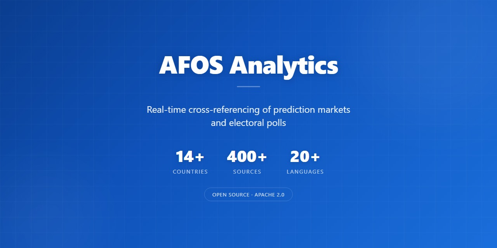
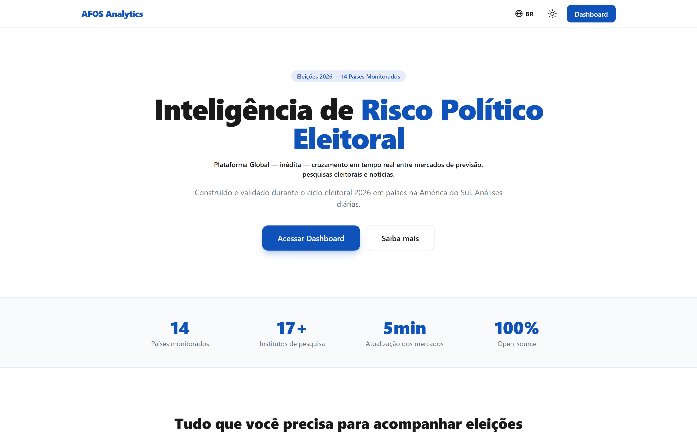

# AFOS Analytics



🇧🇷 Português | 🇺🇸 [Read in English](README.md)

### Plataforma Global — inédita — cruzamento em tempo real entre mercados de previsão, pesquisas eleitorais e notícias.

Construído e validado durante o ciclo eleitoral 2026 em países na América do Sul. Análises diárias.

**Agregando mais de 400 fontes** (5 grandes mercados globais de previsão + 100+ institutos de pesquisa + 300+ meios de comunicação e redes sociais, 20+ idiomas) em **14+ países.**


[](mailto:contact@afos-analytics.com)
[](mailto:security@afos-analytics.com)

**[afos-analytics.com](https://afos-analytics.com)**

> *Democracy runs on information. Information runs on transparency. AFOS Analytics is programmable transparency worldwide.*

> Pipeline escalável com cron, Redis e Neon. Adicione fontes por país conforme as eleições se aproximam.

---

## Sobre

O **AFOS Analytics** é a plataforma inédita no mundo de inteligência de risco político eleitoral que cruza em tempo real:

- **Mercados de previsao** com dinheiro real (Polymarket) — odds atualizadas a cada 30 minutos
- **Pesquisas eleitorais** oficiais do TSE + 17 institutos brasileiros
- **Noticias ao vivo** da grande imprensa
- **Analises estrategicas** com inteligencia artificial
- **AFOS Daily** — sintese narrativa diaria cruzando as tres fontes, com link auditavel por alegacao. Validada em piloto de 7 dias (22-28/Abr/2026), agora permanente — publicada diariamente em 3 idiomas (PT-BR, EN, ES) com arquivo completo em `/daily/[data]`

Cobertura de **14 paises** com eleicoes monitoradas, em **3 idiomas** (PT-BR, EN, ES).

**Open Source. Gratuito. Mobile e desktop.**

### Demo da plataforma (~90 segundos)

[](https://github.com/AFOS-Analytics/afos-analitica-2026/raw/main/public/demo-en.mp4)

> **Clique na imagem acima para tocar** (~9 MB, audio em PT-BR com legendas em ingles embutidas). Cobre: cruzamento em tempo real, mercados de previsao, pesquisas eleitorais, agregacao de noticias e a sintese narrativa **AFOS Daily**. Trilhas alternativas: [`public/demo.mp4`](https://github.com/AFOS-Analytics/afos-analitica-2026/raw/main/public/demo.mp4) (sem legendas) e [`public/demo-audio.m4a`](https://github.com/AFOS-Analytics/afos-analitica-2026/raw/main/public/demo-audio.m4a) (apenas audio).

---

## Comunidade

- 💬 **Dúvidas & ideias** → [GitHub Issues](https://github.com/AFOS-Analytics/afos-analitica-2026/issues) · [Discussions](https://github.com/AFOS-Analytics/afos-analitica-2026/discussions)
- 📧 **Imprensa, parcerias, geral** → [contact@afos-analytics.com](mailto:contact@afos-analytics.com)
- 💡 **Suporte e ajuda ao usuário** → [support@afos-analytics.com](mailto:support@afos-analytics.com)
- 🔒 **Disclosure de vulnerabilidades** → [security@afos-analytics.com](mailto:security@afos-analytics.com) (ver [SECURITY.md](SECURITY.md))
- 👤 **Contato direto com o founder** → [founder@afos-analytics.com](mailto:founder@afos-analytics.com)

Open source, Apache 2.0. Contribuições bem-vindas — veja [CONTRIBUTING.md](CONTRIBUTING.md). O uso da marca "AFOS Analytics" (nome e logo) é regido pelo [TRADEMARK.md](TRADEMARK.md). Contribuições para a plataforma hospedada (onboarding de um novo país) são documentadas em [docs/platform/add-your-country.md](docs/platform/add-your-country.md) e o modelo público de governança é explicado em `/methodology/automated-governance`.

---

## Arquitetura

### Rotas Principais

| Rota | Conteudo |
|------|---------|
| `/[locale]` | Landing page (seletor de cor + idioma) |
| `/[locale]/dashboard` | Dashboard interativo com dados ao vivo — logo do header volta para landing |
| `/[locale]/daily` | AFOS Daily — sintese narrativa diaria cruzando mercados de previsao, pesquisas e noticias. Disponivel em **3 idiomas** (PT-BR, EN, ES) — loader detecta `{data}.{locale}.md` com fallback para o PT-BR canonico. Termos politicos brasileiros (TSE, STF, BolsoMaster, etc.) preservados em PT com links inline para o glossario trilingue |
| `/[locale]/global` | Mapa global de eleicoes (D3.js) |
| `/[locale]/country/[country]` | Pagina por pais (13 paises) |
| `/[locale]/how-it-works` | Guia didatico da metodologia (3 idiomas) — "O Metodo". Tour pela plataforma com 14 secoes incluindo explicacao do card AFOS Daily (`#afos-daily-card`) e criterios de avaliacao dos institutos (`#criterios-institutos`). Usa constantes Tailwind compartilhadas (`styles.ts`) para consistencia visual entre idiomas |
| `/[locale]/methodology/automated-governance` | Pagina publica de governanca (3 idiomas) — como a plataforma hospedada aplica integridade editorial via codigo (validadores automaticos + prompt rules versionadas), os 2 caminhos de interacao (Fork / Country Onboarding) e as 3 excecoes onde o humano intervem |
| `/[locale]/latam` · `/[locale]/eu` | Hubs regionais (America Latina, Europa) |

### Landing Page

- Seletor de tema (branco/azul primary) com transicao animada
- Seletor de idioma (PT-BR/EN/ES) com mini-menu dropdown
- Bandeiras SVG (compativel com todos os dispositivos incluindo Windows)
- Formulario de captura de lead integrado com sistema de visitor tracking
- SEO otimizado com claim "Plataforma inedita no mundo" em metadata

### Sistema de Captura de Leads (Visitor State)

```
Sessao 1-3: Dashboard livre + popup suave (30s + scroll, max 3 dismissals)
Sessao 4+:  Gate obrigatorio (blur + formulario premium)
Apos cadastro: Acesso ilimitado, sem popup/gate
```

| Componente | Funcao |
|---|---|
| `visitor_states` (Neon) | Rastreia visitantes anonimos por visitor_id |
| `POST /api/visitor/state` | Cria/retorna estado do visitante |
| `POST /api/visitor/session` | Registra sessao qualificada (30s + scroll) |
| `POST /api/visitor/dismiss` | Registra dismissal do popup (max 3) |
| `POST /api/visitor/migrate` | Migra inscritos antigos (localStorage → backend) |
| `useVisitorState` hook | Estado central no cliente (cookie + backend) |
| `VisitorStateProvider` | Context React para dashboard |
| `SubscribeForm` | Formulario compartilhado (popup + gate + landing) |
| `DashboardGate` | Blur overlay na 4a sessao |
| `EmailPopup` | Popup suave nas 3 sessoes livres |

**Seguranca:** Backend e fonte de verdade (nao localStorage). Timeout 3s com fallback. Dedup atomico via Redis SET NX. Honeypot anti-bot. Rate limiting.

### Pipeline de Dados (Cron + Upstash Redis + Neon)

```
Background:  Cron 30min  → Polymarket (18 mercados paralelo) → Upstash Redis + Neon
Usuario:     Requisicao  → Redis read (<1ms) → resposta
```

**Arquitetura de cron unico (otimizada para custo + carga):** um unico cron de 30 minutos escreve tanto no Redis (caminho quente para usuarios) quanto no Neon (snapshot historico). Decisao documentada em abril/2026 apos analise de risco/custo: a cadencia de 5 minutos criava pressao excessiva em Vercel e Upstash sob picos de trafego sem ganho relevante de UX (movimentos do Polymarket raramente exigem granularidade sub-30-minutos para analises eleitorais cruzadas). A cadencia de 30 minutos permite scale-to-zero do Neon entre ticks, simplifica operacao (um unico cron) e preserva o diferencial real-time atraves do cruzamento em si, nao da frequencia de polling.

**Cascata de fallback (4 niveis):**

| Nivel | Condicao | Resposta |
|-------|----------|----------|
| 1 | Redis com dados frescos | <1ms (99.9% dos casos) |
| 2 | Redis vazio | Fetch direto Polymarket (~4s) |
| 3 | Polymarket falhou | Dados em memoria (ultimo resultado bom) |
| 4 | Sem nenhum dado | HTTP 503 + Retry-After: 60 |

### Estrutura do Projeto

```
app/
├── [locale]/
│   ├── layout.tsx                     # Layout por locale (metadata + i18n)
│   ├── page.tsx                       # Landing page (LandingPageDual)
│   ├── dashboard/
│   │   ├── layout.tsx                 # Metadata SEO do dashboard
│   │   └── page.tsx                   # Dashboard + Gate + Popup
│   └── global/page.tsx                # Mapa global traduzido
├── components/
│   ├── LandingPageDual.tsx            # Landing com seletor cor/idioma
│   ├── DashboardGate.tsx              # Gate blur overlay
│   ├── EmailPopup.tsx                 # Popup suave
│   ├── SubscribeForm.tsx              # Formulario compartilhado
│   ├── FlagImg.tsx                    # Bandeira SVG cross-platform
│   ├── Header.tsx / Footer.tsx        # Header e footer traduzidos
│   ├── PolymarketSection.tsx          # Odds ao vivo
│   ├── PollsSection.tsx               # Pesquisas eleitorais
│   ├── global-map/                    # D3 + TopoJSON + SVG
│   └── ...                            # Demais secoes do dashboard
├── hooks/
│   ├── useDashboardData.ts            # Data fetching (5 APIs paralelo)
│   └── useVisitorState.tsx            # Estado do visitante (context)
├── api/
│   ├── visitor/state/session/dismiss/migrate/  # Visitor tracking
│   ├── subscribe/                     # Captura email
│   ├── cron/refresh-elections/        # Cron 30min → Redis + Neon (unificado)
│   ├── cron/refresh-polls/            # Cron 3x/dia → TSE
│   ├── admin/analytics/               # Analytics detalhado (Neon)
│   ├── admin/search-console/          # Google Search Console API
│   ├── admin/metrics/                 # Dashboard executivo
│   └── ...                            # Demais endpoints
├── lib/
│   ├── polymarket/                    # Client, registry, bootstrap, persist
│   ├── email/                         # Subscribers, Resend, templates
│   ├── cache/                         # Cache multi-camada
│   └── kv.ts                          # Wrapper Upstash Redis
lib/
├── db.ts                              # Prisma singleton (Neon)
├── visitor/constants.ts               # Constantes centralizadas do visitor system
├── visitor/id.ts                      # Visitor ID (cookie + localStorage)
├── seo/metadata.ts                    # buildMetadata() com claim + hreflang
├── seo/schema.ts                      # 6 schemas JSON-LD
├── validations/index.ts               # Zod schemas
├── audit.ts                           # Audit trail
├── consent.ts                         # LGPD consent
├── ai/                                # Guardrails, translate, prompts
├── i18n/                              # Config, messages, glossary
├── governance/                        # Data lifecycle, LGPD
└── security/                          # Output sanitization
prisma/
├── schema.prisma                      # 20 tabelas, 6 schemas
└── migrations/
public/
├── flags/                             # 16 bandeiras SVG (cross-platform)
├── geo/world-110m.json                # TopoJSON para mapa global
└── ...
```

---

## Internacionalizacao (i18n)

| Idioma | Rota | Status |
|--------|------|--------|
| Portugues (BR) | `/pt-BR` | Default |
| English | `/en` | Completo |
| Espanol | `/es` | Completo |

- **244+ chaves** × 3 idiomas = 732+ strings traduzidas
- **Language Switcher**: dropdown na landing e no dashboard
- **Cookie** `NEXT_LOCALE`: persiste preferencia
- **Content-Language**: header dinamico por locale no middleware
- **Geo tags**: `geo.region` e `geo.placename` por locale (BR/Global/LATAM)

---

## SEO / GEO

### Metadata por Locale

Cada pagina gera metadata nativa no idioma correto via `buildMetadata()`:
- Title com claim "Plataforma Inedita no Mundo"
- Description com posicionamento unico
- Canonical + hreflang cruzado (pt-BR, en, es, x-default)
- Open Graph + Twitter Card
- Geo tags por locale

### Google Search Console

Integrado via `POST /api/admin/search-console`:
- Impressoes, cliques, CTR, posicao media
- Breakdown por pagina, query, pais, device
- Secao especial `seoGeo` para paginas de pais
- Auth: Bearer CRON_SECRET

### Schema.org (7 tipos)

Organization, WebApplication, Dataset, WebSite, FAQPage, BreadcrumbList, Article

### Otimizacao para IA (GEO)

- **`public/llms.txt`** — Descreve a plataforma para AI crawlers (ChatGPT, Perplexity, Claude, Gemini) seguindo padrao emergente da industria
- **13 AI crawlers permitidos explicitamente** em `app/robots.ts`: GPTBot, anthropic-ai, ClaudeBot, Claude-Web, PerplexityBot, Perplexity-User, Google-Extended, CCBot, Bytespider, Applebot-Extended, cohere-ai, Meta-ExternalAgent, FacebookBot
- **JSON-LD Article schema** em `/how-it-works` para atribuicao em citacoes de motores generativos
- **Atribuicao transparente de IA** — analises geradas por inteligencia artificial a partir de dados publicos e auditaveis

### Paginas indexaveis (~120+ com hreflang)

| Tipo | Paginas | Prioridade |
|------|---------|-----------|
| Landing page | 3 | 1.0 |
| Dashboard | 3 | 0.95 |
| Mapa Global | 3 | 0.9 |
| Pais (13 × 3) | 39 | 0.8 |
| Eleicao (13 × 3) | 39 | 0.7-0.9 |
| Institucional (7 × 3) | 21 | 0.8 |
| Regiao (2 × 3) | 6 | 0.85 |
| Como Funciona (1 × 3) | 3 | 0.85 |

---

## Mapa Global de Eleicoes

- **D3.js + TopoJSON** — Natural Earth projection, SVG render
- **14 paises** com dados ao vivo do Polymarket
- **Bandeiras SVG** — visiveis em todos os dispositivos (Windows, Mac, mobile)
- **Volume com label**: "Vol: $53.4M (somatorio 6 mercados)" quando multiplos mercados
- **Hover** — tooltip com candidato lider, probabilidade, volume
- **Click** — drawer lateral com breakdown de candidatos
- **Zoom/Pan** — d3-zoom (1x-8x)

---

## Analytics

### /api/admin/analytics
Analytics detalhado do Neon: curva de leads, pipeline health, engajamento, audit logs, AI runs.

### /api/admin/search-console
Dados do Google Search Console: impressoes, cliques, CTR, posicao media, performance de paginas de pais (SEO GEO).

### /api/admin/metrics
Dashboard executivo: contagens pontuais de leads, precos, audit logs, LLM runs, deletion requests.

---

## Ingestao TSE (Pesquisas Eleitorais)

```
Cron 3x/dia (6h, 12h, 18h)
  → cdn.tse.jus.br/pesquisa_eleitoral_2026.zip
  → Parse CSV (180+ pesquisas presidenciais)
  → Neon: research.sources + research_runs + research_findings
  → Cruzamento: pesquisas recentes (15 dias) × odds Polymarket
```

---

## Banco de Dados (Neon Postgres)

6 schemas, 20 tabelas, UUID PKs, timestamptz:

| Schema | Tabelas | Proposito |
|--------|---------|-----------|
| **iam** | users, user_preferences, user_consents | Identidade, LGPD |
| **crm** | leads, contact_events, visitor_states | Leads, visitor tracking |
| **research** | sources, runs, findings, reports, cross_signals | Pesquisas, cruzamentos |
| **market** | events, markets, outcomes, prices, forecasts | Polymarket, serie temporal |
| **governance** | audit_logs, deletion_requests | Auditoria, LGPD Art. 18 |
| **ai** | llm_runs, model_outputs | Tracking IA, guardrails |

---

## Seguranca

| Camada | Medidas |
|--------|---------|
| **Web** | CSP (unsafe-eval so em dev), HSTS, X-Frame-Options, Referrer-Policy |
| **API** | Rate limiting distribuido (Upstash), timeout, slug validation |
| **Auth** | timing-safe compare, Bearer token, x-vercel-cron |
| **Email** | Honeypot anti-bot, rate limit 5/IP/hora, Zod validation |
| **Visitor** | Backend source of truth, Redis SET NX dedup, 3s timeout |
| **IA** | Prompt injection detection, output sanitization, risk scoring |
| **LGPD** | Consent tracking, exclusao atomica, anonimizacao, audit trail |

---

## Tech Stack

| Tecnologia | Uso |
|---|---|
| **Next.js 14** | App Router, RSC, TypeScript, Middleware |
| **Prisma 7** | ORM com multiSchema (6 schemas, 20 tabelas) |
| **Neon Postgres** | Banco principal (pooled + unpooled) |
| **D3.js + TopoJSON** | Mapa global SVG interativo |
| **Tailwind CSS** | Design system |
| **Zod** | Validacao de inputs |
| **Vercel** | Hosting, Edge Runtime, Cron |
| **Upstash Redis** | Hot cache, rate limiting, session dedup |
| **Resend** | Email transacional |
| **Polymarket API** | Mercados de previsao (18 mercados, 14 paises) |
| **Google News RSS + Firecrawl** | Noticias ao vivo |
| **Vercel Analytics** | Metricas de trafego |

---

## APIs (22+ endpoints)

| Endpoint | Descricao |
|---|---|
| `/api/visitor/state` | Estado do visitante (get/create) |
| `/api/visitor/session` | Registra sessao qualificada |
| `/api/visitor/dismiss` | Registra dismissal popup |
| `/api/visitor/migrate` | Migra inscritos legados |
| `/api/subscribe` | Captura email (visitorId + captureSource) |
| `/api/global-map` | Eleicoes globais (Redis → Polymarket) |
| `/api/cron/refresh-elections` | Cron 30min — Polymarket → Redis + Neon (unificado, um fetch por tick) |
| `/api/cron/refresh-polls` | Cron 3x/dia TSE |
| `/api/cron/persist-analysis` | Cron 1x/dia — persiste JSONs de analise e markdown do AFOS Daily no Neon |
| `/api/polymarket` | Odds BR |
| `/api/polls` / `/api/polls/tse` | Pesquisas |
| `/api/news` | Noticias |
| `/api/admin/analytics` | Analytics detalhado |
| `/api/admin/search-console` | Google Search Console |
| `/api/admin/metrics` | Dashboard executivo |
| `/api/admin/data-request` | LGPD exclusao/exportacao |
| `/api/health` | Health check |
| `/api/translations` | Pipeline traducao IA |
| `/api/market/history` | Serie temporal odds |

---

## O que significa AFOS?

| Letra | Significado | Descricao |
|---|---|---|
| **A** | Astuteness | Inteligencia para cruzar dados e gerar clareza |
| **F** | Fairness | Imparcialidade verificavel no tratamento de cada fonte |
| **O** | Objectivity | Neutralidade analitica - observamos os dados, nao tomamos partido |
| **S** | Synthesis | Transformar dados complexos em entendimento simples |

---

## Configuracao

```bash
git clone https://github.com/AFOS-Analytics/afos-analitica-2026.git
cd afos-analitica-2026
npm install
cp .env.example .env.local
# Preencher env vars (ver .env.example)
npx prisma migrate dev
npx tsx scripts/seed-dev.ts
npm run dev
```

---

## Documentacao

| Documento | Conteudo |
|-----------|---------|
| [docs/DATABASE.md](docs/DATABASE.md) | Schemas, tabelas, convencoes |
| [docs/LGPD.md](docs/LGPD.md) | Matriz PII, retencao, runbooks |
| [docs/OPERATIONS.md](docs/OPERATIONS.md) | Deploy, rollback, observabilidade |
| [docs/platform/add-your-country.md](docs/platform/add-your-country.md) | Guia passo-a-passo para onboardar um novo pais na plataforma hospedada (configuracao, nao conteudo diario) |
| [TRADEMARK.md](TRADEMARK.md) | Politica de trademark do AFOS Analytics (o que forkers podem/nao podem fazer com nome e logo) |
| [docs/como-funciona-afos.html](docs/como-funciona-afos.html) | Guia didatico da metodologia (fonte) |
| [V1 README](docs/README-v1.pt-BR.md) | Como tudo comecou |

---

## Claude Code

| Comando | Descricao |
|---------|-----------|
| `/atualizar` | Atualizacao completa do AFOS Analytics (Polymarket + Google News + JSONs + deploy) |
| `/atualizar-pesquisas` | Ingestao de pesquisas eleitorais do TSE |
| `/afos-daily` | Gera a sintese narrativa diaria (AFOS Daily) — cruza mercados, pesquisas e noticias com link auditavel por alegacao |

---

## Contato

| Finalidade | Email |
|------------|-------|
| Geral, imprensa, parcerias | [contact@afos-analytics.com](mailto:contact@afos-analytics.com) |
| Suporte e ajuda ao usuário | [support@afos-analytics.com](mailto:support@afos-analytics.com) |
| Disclosure de vulnerabilidades | [security@afos-analytics.com](mailto:security@afos-analytics.com) |
| Contato direto com o founder | [founder@afos-analytics.com](mailto:founder@afos-analytics.com) |

Para bugs e pedidos de features, use [GitHub Issues](https://github.com/AFOS-Analytics/afos-analitica-2026/issues).

---

*AFOS Analytics — Plataforma inédita no mundo: Inteligência de Risco Político Eleitoral em tempo real.*
