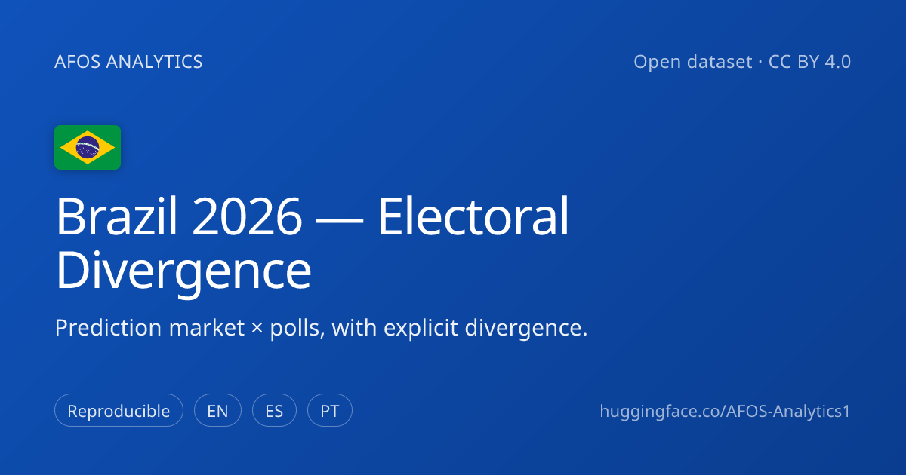

---
license:
- cc-by-4.0
- apache-2.0
language:
- pt
- en
- es
pretty_name: "AFOS — Brazil 2026 Electoral Divergence"
tags:
- elections
- brazil
- prediction-markets
- polls
- political-risk
- divergence
- civic-tech
- open-data
# As tabelas navegaveis, declaradas uma a uma. Sem esta lista o visualizador do
# HF tenta empilhar TODOS os arquivos num split unico, esbarra no datapackage.json
# (que e metadado, nao dado) e derruba a pagina inteira: medido em 22/Ago/2026,
# os cinco indicadores em false e 0 de 2,5 MB servidos. A primeira entrada e a que
# a pagina ABRE, e por isso e a serie de divergencia, que e a identidade do bundle.
configs:
  - config_name: divergence_daily
    data_files:
      - split: train
        path: data/divergence-daily-timeseries.csv
  - config_name: divergence_by_poll
    data_files:
      - split: train
        path: data/divergence-timeseries.csv
  - config_name: poll_divergence
    data_files:
      - split: train
        path: data/poll-divergence.csv
  - config_name: market_odds
    data_files:
      - split: train
        path: data/market-odds-timeseries.csv
  - config_name: polls_first_round
    data_files:
      - split: train
        path: polls/national-poll-results-firstround.csv
  - config_name: polls_second_round
    data_files:
      - split: train
        path: polls/national-poll-results-secondround.csv
  - config_name: sample_demographics
    data_files:
      - split: train
        path: polls/sample-demographics.csv
  - config_name: tse_registry
    data_files:
      - split: train
        path: polls/tse-registry.csv
---

# AFOS — Brazil 2026 Electoral Divergence Dataset

🌐 **[English](#english) · [Português](#português) · [Español](#español)**

---

## English

Open, auditable daily dataset that cross-references **prediction markets (Polymarket) × polling institutes (TSE-registered) × press coverage** for Brazil's 2026 presidential cycle, with **explicit divergence** between sources instead of smoothed averages.

Maintained by **[AFOS Analytics](https://afos-analytics.com)** — open-source civic infrastructure for electoral political-risk intelligence. This is the public mirror of the same data the platform serves live, updated daily. Files are **dated and append-only**: each day adds new files, past dates are never overwritten, and every update is a git commit — so the full history is preserved natively.

**🔒 No personal data (privacy / LGPD):** contains **only public electoral data** (market odds, registered polls, news links). **No subscriber data, no emails, no leads, no personal information of any kind.** The export pipeline is database-free by construction and never accesses any user table. Brazil's LGPD and equivalent principles are respected in full.

**License (dual):** **Data** → CC BY 4.0 (`LICENSE-CC-BY-4.0`); **code/scripts** → Apache 2.0 (`LICENSE-APACHE-2.0`). Both **require attribution** to AFOS Analytics.

**Cite:** *AFOS Analytics. Brazil 2026 Electoral Divergence Dataset. Hugging Face, 2026. CC BY 4.0.*

**Permanent archive:** also deposited at the **[Harvard Dataverse](https://dataverse.harvard.edu/dataset.xhtml?persistentId=doi:10.7910/DVN/2D0UK7)** — DOI [10.7910/DVN/2D0UK7](https://doi.org/10.7910/DVN/2D0UK7).

**Disclaimer:** observational research. **Not investment advice, not voting guidance.** AFOS observes the markets — it does not trade them.

---

## Português

Dataset diário aberto e auditável que cruza **mercados de previsão (Polymarket) × institutos de pesquisa (registrados no TSE) × cobertura de imprensa** para o ciclo presidencial brasileiro de 2026, com **divergência explícita** entre as fontes em vez de médias suavizadas.

Mantido pela **[AFOS Analytics](https://afos-analytics.com)** — infraestrutura cívica open-source de inteligência de risco político eleitoral. É o espelho público dos mesmos dados que a plataforma serve ao vivo, atualizado diariamente. Os arquivos são **datados e append-only**: cada dia adiciona novos arquivos, datas passadas nunca são sobrescritas, e cada atualização é um commit git — o histórico completo fica preservado nativamente.

**🔒 Sem dados pessoais (privacidade / LGPD):** contém **apenas dados eleitorais públicos** (odds de mercado, pesquisas registradas, links de notícia). **Nenhum dado de assinante, nenhum email, nenhum lead, nenhuma informação pessoal.** O pipeline de export é database-free por construção e nunca acessa qualquer tabela de usuário. A LGPD e princípios equivalentes são respeitados integralmente.

**Licença (dual):** **Dados** → CC BY 4.0 (`LICENSE-CC-BY-4.0`); **código/scripts** → Apache 2.0 (`LICENSE-APACHE-2.0`). Ambas **exigem atribuição** à AFOS Analytics.

**Citação:** *AFOS Analytics. Brazil 2026 Electoral Divergence Dataset. Hugging Face, 2026. CC BY 4.0.*

**Arquivo permanente:** também depositado no **[Harvard Dataverse](https://dataverse.harvard.edu/dataset.xhtml?persistentId=doi:10.7910/DVN/2D0UK7)** — DOI [10.7910/DVN/2D0UK7](https://doi.org/10.7910/DVN/2D0UK7).

**Aviso:** pesquisa observacional. **Não é recomendação de investimento nem orientação de voto.** A AFOS observa os mercados — não opera neles.

---

## Español

Dataset diario abierto y auditable que cruza **mercados de predicción (Polymarket) × encuestadoras (registradas en el TSE) × cobertura de prensa** para el ciclo presidencial brasileño de 2026, con **divergencia explícita** entre las fuentes en lugar de promedios suavizados.

Mantenido por **[AFOS Analytics](https://afos-analytics.com)** — infraestructura cívica open-source de inteligencia de riesgo político electoral. Es el espejo público de los mismos datos que la plataforma sirve en vivo, actualizado diariamente. Los archivos son **fechados y append-only**: cada día agrega archivos nuevos, las fechas pasadas nunca se sobrescriben, y cada actualización es un commit git — el historial completo se preserva de forma nativa.

**🔒 Sin datos personales (privacidad / LGPD):** contiene **solo datos electorales públicos** (odds de mercado, encuestas registradas, enlaces de noticias). **Ningún dato de suscriptor, ningún email, ningún lead, ninguna información personal.** El pipeline de exportación es database-free por construcción y nunca accede a ninguna tabla de usuarios. La LGPD y principios equivalentes se respetan íntegramente.

**Licencia (dual):** **Datos** → CC BY 4.0 (`LICENSE-CC-BY-4.0`); **código/scripts** → Apache 2.0 (`LICENSE-APACHE-2.0`). Ambas **requieren atribución** a AFOS Analytics.

**Citar:** *AFOS Analytics. Brazil 2026 Electoral Divergence Dataset. Hugging Face, 2026. CC BY 4.0.*

**Archivo permanente:** también depositado en el **[Harvard Dataverse](https://dataverse.harvard.edu/dataset.xhtml?persistentId=doi:10.7910/DVN/2D0UK7)** — DOI [10.7910/DVN/2D0UK7](https://doi.org/10.7910/DVN/2D0UK7).

**Aviso:** investigación observacional. **No es asesoría de inversión ni orientación de voto.** AFOS observa los mercados — no opera en ellos.

---

## 📁 Structure · Estrutura · Estructura

Full column-level definitions for every file are in **[`DATA_DICTIONARY.md`](DATA_DICTIONARY.md)**. Citation metadata in **[`CITATION.cff`](CITATION.cff)**; version history in **[`CHANGELOG.md`](CHANGELOG.md)**.

### 🗳️ Electoral polls (priority) · Pesquisas eleitorais · Encuestas

| Path | Rows | Content |
|------|------|---------|
| `polls/tse-registry.csv` · `.json` | 399 | **Official TSE poll registry — full public fields**, built directly from the [TSE Open Data](https://dadosabertos.tse.jus.br) file. Every presidential poll filed for 2026 with its complete registration sheet: institute, CNPJ, sample, field dates, declared cost, **named responsible statistician + CONRE**, and the **full (un-truncated) methodology and sampling/weighting design** — including the demographic/geographic quota design (sex, age, education, income, region) with the declared quota percentages. *Registration-design fields only — no per-candidate results, and the complete questionnaire is a PesqEle attachment, not in the open-data file.* (`Lei 9.504/97 art. 33`) |
| `polls/national-poll-results-firstround.csv` | 196 | **Published first-round results**, long format: one row per candidate × scenario × poll. Carries the TSE registration number, institute, sample, margin, field dates. |
| `polls/national-poll-results-secondround.csv` | 50 | Published head-to-head **runoff** matchups (`candidate1 vs candidate2`, percentages). |
| `polls/national-polls.json` | 32 | Full structured national polls **with results** (first round + runoff + methodology), reconstructed from the platform history. Each poll carries a **`tse_registration`** block (full methodology, sampling/weighting design, statistician, CONRE, CNPJ, cost) and, since 2026-06-13, **fieldwork-midpoint dating** (`field_midpoint`, `days_to_first_round`/`runoff`) plus **`tse_registration.sample_design`** (parsed sample composition/weighting — layer A). |
| `polls/sample-demographics.csv` | 159 | **Sample-design demographics (layer A)**, long format: each poll's declared sex/age/education/income quota composition parsed from the TSE sampling plan, with explicit per-poll coverage (`full_percentages` 15/32 · `mentioned_no_pct` 17/32). This is sample composition/weighting — **not** vote-by-demographic crosstabs (layer B), which are not part of TSE open data. |
| `polls/polls-data-{date}.json` | — | Daily snapshot of the national polls referenced on that date. |

### 📈 Market & divergence time-series

| Path | Content |
|------|---------|
| `data/market-odds-timeseries.csv` | **Polymarket presidential odds per candidate, daily** (`date, candidate, party, polymarket_pct, volume_usd_m`) — full history from 2026-04-04. |
| `data/divergence-timeseries.csv` | **Market × poll divergence** per candidate (`poll_date, institute, register_tse, candidate, poll_pct, polymarket_pct, polymarket_date, divergence_pp`) — each national poll joined to the market odds on its date. The dataset's namesake signal. |
| `data/poll-divergence.csv` | **Poll-level market × poll pairing** anchored on each poll's **fieldwork midpoint**; `naive_gap_pp` is explicitly flagged `naive_winprob_minus_voteshare` — the market prices *P(win)* while the poll reports *vote share*, so the gap is **not scale-reconciled** (reconciling the scales is a modeling choice left to the researcher). |
| `data/divergence-{date}.csv` | Per-day market × poll divergence snapshot. |

### 📰 Daily analysis & news

| Path | Content |
|------|---------|
| `snapshots/analysis-criteriosa/{date}.json` | Daily analysis: market × poll × press, per candidate (incl. `quadroComparativo`). |
| `snapshots/analysis-cards/{date}.json` | Thematic cards (sentiment, institutional, macro). |
| `news/news-{date}.json` | Public news **links** (source, title, URL, date) — no article bodies. |

## 🎓 For researchers

- **Start with** `DATA_DICTIONARY.md` (every column, type, unit, provenance) and `polls/` (the registered-poll universe + published results).
- **Reproducibility:** every value traces to a public primary source — the TSE registry, a named pollster's release, or a live Polymarket contract. Nothing is imputed or smoothed; where a number is missing it is left blank, not filled.
- **Editorial stance:** AFOS reports *divergence* between sources rather than a single blended average — the spread is treated as signal, not noise.
- **Demographics:** *sample-design* demographics — the declared composition/weighting of each poll's sample (layer A) — are included (`polls/sample-demographics.csv`). *Vote-by-demographic crosstabs* (layer B — e.g. vote share by sex/age/income) are **not** part of Brazil's TSE open data; institutes publish those separately, so they are intentionally absent here rather than partially scraped.
- **Scale caveat (market vs poll):** Polymarket prices *probability of winning*; polls report *vote share*. The two divergence files keep both raw values side by side and flag the naive gap accordingly — they are not a like-for-like error metric.
- **Updates:** dated and append-only; each daily commit preserves the full history natively (see `CHANGELOG.md`). The file for the *current* date may be regenerated during the day; files for dates already closed are never modified.
- **Known errors:** see **`ERRATA.md`**. When a defect is found in a past date, the file is **not** rewritten — the correction is published in the errata instead, so the record stays as distributed and the defect stays discoverable. *Erros conhecidos em `ERRATA.md`. · Errores conocidos en `ERRATA.md`.*

**Sources / Fontes / Fuentes:** Polymarket (live USD markets) · TSE-registered institutes · 400+ press outlets. Method & source code (Apache 2.0): [github.com/AFOS-Analytics](https://github.com/AFOS-Analytics).
